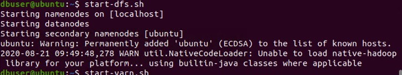
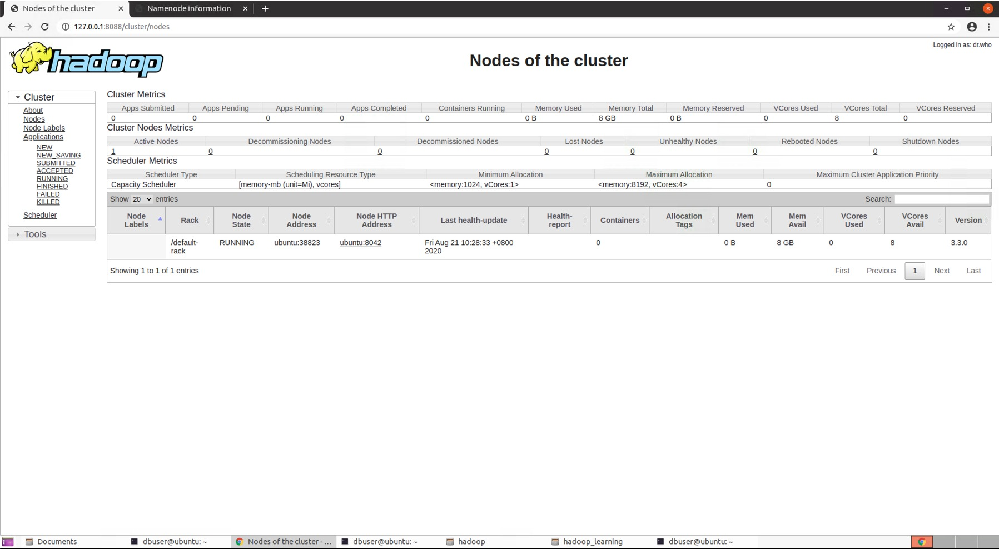
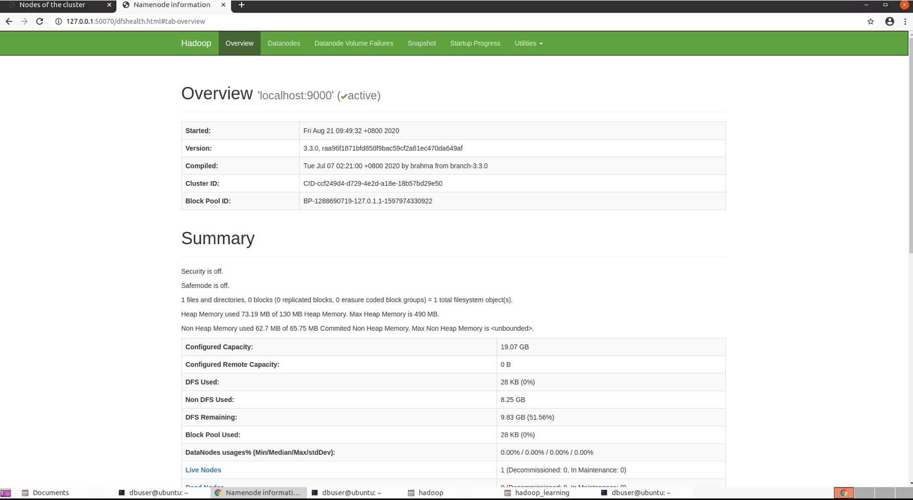

Hadoop 安装
===

安装参考的是《Python + Spark 2.0+Hadoop机器学习与大数据实战》（林大贵 著），首先吐槽一下，林大贵的几本书前几章的内容完全一样，尤其是上面提到的这本与《Hadoop + Spark大数据巨量分析与机器学习实战》，两本书前7章内容完全一致。  
买了两本书其实相当于买了一本半，并且重复的都是非常基础的部分。对于整本书来说倒是降低了写作的难度和时间，并且两本书的实例也基本一致，不过使用的语言略有不同。  
书上介绍的安装版本比较老旧，也没有必要去安装一个老旧的版本。所以这里我安装的是3.3.0
具体的安装流程可以参考这个链接：http://hadoopspark.blogspot.com/2015/09/4-hadoop-26-single-node-cluster.html  
不过需要注意的是里面的几条命令可能稍微有些问题：
使用下面的这条命令生成的key文件对应的host是本机的主机名：
```bash
ssh-keygen -t dsa -P '' -f ~/.ssh/id_dsa
```
如果系统没有设置hostname，可以使用下面的命令生成key：
```bash
ssh localhost ssh-keygen -t rsa
```
两者的区别在于第一条命令生成的是username@hostname，第二条名称生成的是username@localhost  

另外一个需要注意的是，直接按照文件中的配置，最终hdfs web界面可能无法访问，需要修改hdfs-site.xml添加以下配置信息：
```xml
<property>
	<name>dfs.http.address</name>
	<value>0.0.0.0:50070</value>
</property>
```
这样hdfs web界面就可以正常访问了。
安装完成之后启动hdfs的时候，可能会出现如下错误：  
  
Unable to load native-hadoop library for your platform  
搜索以下会发现网上的各种说法，以及解决方案，但是这些解决方法基本都是一个瞎试的状态。可以参考这个链接：https://stackoverflow.com/questions/19943766/hadoop-unable-to-load-native-hadoop-library-for-your-platform-warning  
修改l4j的配置文件，查看问题具体是出在什么地方,修改log4j.properties增加如下行：  
```bash
log4j.logger.org.apache.hadoop.util.NativeCodeLoader=DEBUG
```
然后运行：
```bash
hadoop checknative -a
```
就可以看到具体的日志信息了：
```log
hadoop checknative -a
2020-08-21 10:13:10,474 DEBUG util.NativeCodeLoader: Trying to load the custom-built native-hadoop library...
2020-08-21 10:13:10,478 DEBUG util.NativeCodeLoader: Failed to load native-hadoop with error: java.lang.UnsatisfiedLinkError: /usr/local/hadoop/lib/native/libhadoop.so.1.0.0: /usr/local/hadoop/lib/native/libhadoop.so.1.0.0: cannot open shared object file: No such file or directory (Possible cause: can't load AARCH64-bit .so on a AMD 64-bit platform)
2020-08-21 10:13:10,478 DEBUG util.NativeCodeLoader: java.library.path=/usr/local/hadoop/lib/:/usr/local/hadoop/lib/native
2020-08-21 10:13:10,478 WARN util.NativeCodeLoader: Unable to load native-hadoop library for your platform... using builtin-java classes where applicable
Native library checking:
hadoop:  false 
zlib:    false 
zstd  :  false 
snappy:  false 
lz4:     false 
bzip2:   false 
openssl: false 
ISA-L:   false 
PMDK:    false 
2020-08-21 10:13:10,864 INFO util.ExitUtil: Exiting with status 1: ExitException
```
最终的原因在于电脑用的amd的处理器，Possible cause: can't load AARCH64-bit .so on a AMD 64-bit platform，所以百度搜索到的解决方法都没啥用，也解决不了这个问题。虽然有个警告，但是实际的使用是没有问题的。
  


