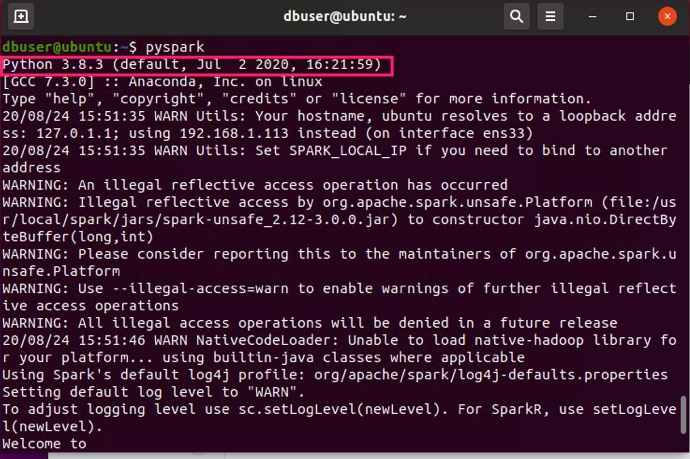
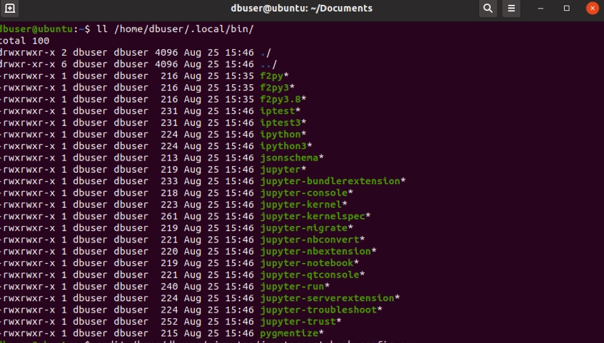
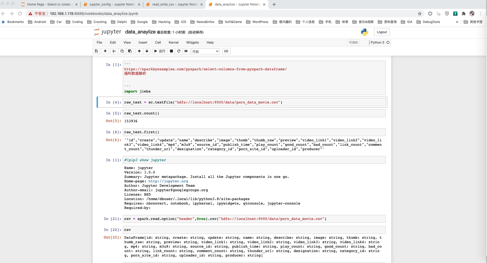

spark安装
===

spark默认使用的Python版本为2，可以修改.bashrc文件让spark默认使用python3。修改.bashrc增加如下行：  
```bash
# anaconda
export ANACONDA_HOME=/home/dbuser/anaconda3/
export PATH=$ANACONDA_HOME:$PATH
# spark
export PYSPARK_PYTHON=/home/dbuser/anaconda3/bin/python3
```
然后重新启动pyspark就是3了，anaconda下的python文件版本也是2。  
  

如果要用jupyter的方式运行spark，可以通过anaconda来完成，安装完成后使用本地端口没有问题，但是如果要配置允许远程访问以及设置访问密码，需要运行：  
```bash
jupyter notebook --generate-config
```
不过如果直接运行和可能会提示：
```log
/bin/bash: jupyter: command not found
```
这是因为anaconda的bin目录没有加入path，可以通过将/home/dbuser/.local/bin目录加入.bashrc 或者直接通过全路径运行。  
  
```bash
!/home/dbuser/.local/bin/jupyter notebook --generate-config
```
在生成的配置文件中加入如下几行：  
```python
c.NotebookApp.ip="*"
c.NotebookApp.allow_remote_access=True
c.NotebookApp.open_browser=False
# passwor=whoami
c.NotebookApp.password="argon2:$argon2id$v=19$m=10240,t=10,p=8$2fROaofTc+MXONw9BE6PxA$6P3Hf4PWBnAWC0dYDn10Cg"
```
然后执行如下命令即可远程访问jupyter notebook:  
```bash
export PYSPARK_DRIVER_PYTHON_OPTS="notebook" pyspark
```
  

