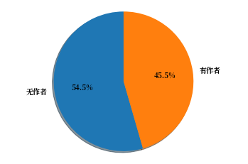
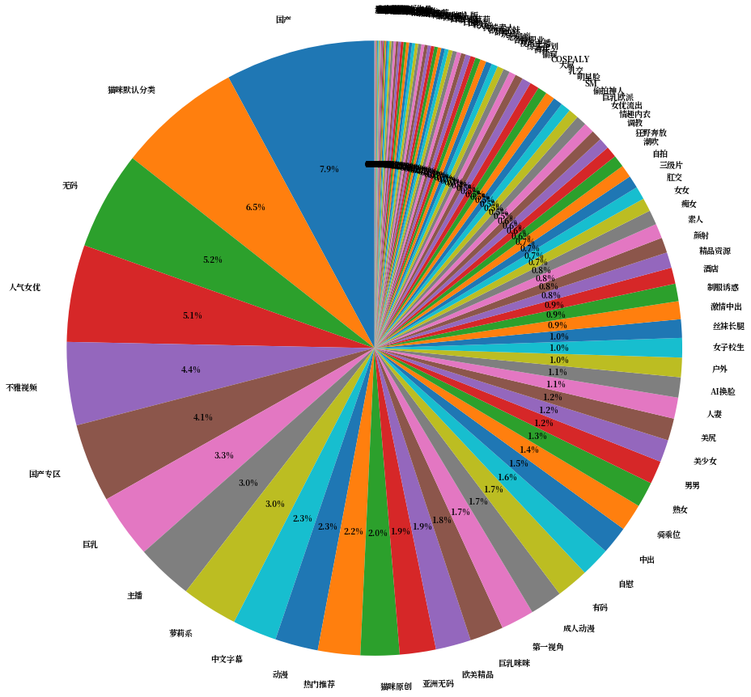

```python
'''
视频作者 视频分类信息分析
http://www.h4ck.org.cn
by obaby
obaby@mars
email:root@obaby.org.cn
date: 2020.09.04
'''

from pyspark.sql.functions import col
import altair as alt

import pandas as pd
from matplotlib import pyplot as plt
%matplotlib inline
```


```python
csv = spark.read.option("header",True).csv("hdfs://localhost:9000/data2/porn_data_movie.csv")
```


```python
csv.printSchema()
```

    root
     |-- id: string (nullable = true)
     |-- create: string (nullable = true)
     |-- update: string (nullable = true)
     |-- name: string (nullable = true)
     |-- describe: string (nullable = true)
     |-- source_id: string (nullable = true)
     |-- publish_time: string (nullable = true)
     |-- play_count: string (nullable = true)
     |-- good_count: string (nullable = true)
     |-- bad_count: string (nullable = true)
     |-- link_count: string (nullable = true)
     |-- comment_count: string (nullable = true)
     |-- designation: string (nullable = true)
     |-- category_id: string (nullable = true)
     |-- porn_site_id: string (nullable = true)
     |-- uploader_id: string (nullable = true)
     |-- producer: string (nullable = true)
    


```python
csv.select('name', 'describe', 'uploader_id').show()
```

    +------------------------+------------------------+-----------+
    |                    name|                describe|uploader_id|
    +------------------------+------------------------+-----------+
    |    美女学生考试时被中出|                    null|          1|
    |      无套中出内射（上）|            无套中出内射|          2|
    |      无套中出内射（下）|            无套中出内射|          2|
    |                极品嫩妹|                    null|          3|
    |                骚妹妹 7|                    null|          3|
    |漂亮美女完美身材甜美声音|漂亮美女完美身材甜美声音|          4|
    |          jk捆绑萝莉束缚|                    null|          1|
    |            最纯萝莉性爱|                    null|          1|
    |          整容脸制服美女|                    null|          1|
    |             星 调教萝莉|                    null|          5|
    |        大一学生寝室自慰|                    null|          6|
    |    超性感美女给你打飞机|                    null|          6|
    |      超可爱萝莉下海资源|                    null|          6|
    |      迷倒女儿然后慢慢操|                    null|          6|
    |   精灵做爱高潮–影视剪辑|                    null|          7|
    |        小萝莉被插到大叫|                    null|          6|
    |    睡醒和白嫩女友来一发|                    null|          6|
    |  双马尾萝莉甜美自慰诱惑|                    null|          8|
    |        调教双马尾小萝莉|                    null|          1|
    |    黑丝小萝莉最喜欢玩具|                    null|          9|
    +------------------------+------------------------+-----------+
    only showing top 20 rows
    


```python
uploader_csv = spark.read.option("header",True).csv("hdfs://localhost:9000/data2/porn_data_uploader.csv")
```


```python
uploader_csv.printSchema()
```

    root
     |-- id: string (nullable = true)
     |-- uid: string (nullable = true)
     |-- create: string (nullable = true)
     |-- update: string (nullable = true)
     |-- name: string (nullable = true)
     |-- nickname: string (nullable = true)
     |-- describe: string (nullable = true)
     |-- porn_site_id: string (nullable = true)
    


```python
uploader_csv.select('name', 'id', 'nickname', 'porn_site_id').show()
```

    +--------------+---+--------------+------------+
    |          name| id|      nickname|porn_site_id|
    +--------------+---+--------------+------------+
    |      双休姐姐|  1|      双休姐姐|           1|
    |       huang86|  2|       huang86|        null|
    |     豆腐乳123|  3|     豆腐乳123|           1|
    |        小佑ya|  4|        小佑ya|           1|
    |    蘿莉即正义|  5|    蘿莉即正义|           1|
    |      绘画少女|  6|      绘画少女|           1|
    |       7号玩家|  7|       7号玩家|           1|
    |    苏大大大萌|  8|    苏大大大萌|           1|
    |采菇凉滴小蘑菇|  9|采菇凉滴小蘑菇|           1|
    |        谷之岚| 10|        谷之岚|           1|
    |早乙女由依视频| 11|早乙女由依视频|        null|
    |      至尊小宝| 12|      至尊小宝|           1|
    |    辉哥搞事情| 13|    辉哥搞事情|           1|
    |       王牌20i| 14|       王牌20i|           1|
    |        草莓群| 15|        草莓群|        null|
    |      萝莉不酱| 16|      萝莉不酱|           1|
    |      奈何不了| 17|      奈何不了|           1|
    |        meitub| 18|        meitub|        null|
    |        邦哥88| 19|        邦哥88|           1|
    |        调淫师| 20|        调淫师|           1|
    +--------------+---+--------------+------------+
    only showing top 20 rows
    


```python
movie_csv = csv.withColumnRenamed('name','movie_name')

```


```python
movie_csv.show()
```

    +---+--------------------+--------------------+------------------------+------------------------+---------+------------+----------+----------+---------+----------+-------------+-----------+-----------+------------+-----------+--------+
    | id|              create|              update|              movie_name|                describe|source_id|publish_time|play_count|good_count|bad_count|link_count|comment_count|designation|category_id|porn_site_id|uploader_id|producer|
    +---+--------------------+--------------------+------------------------+------------------------+---------+------------+----------+----------+---------+----------+-------------+-----------+-----------+------------+-----------+--------+
    |  1|7/5/2020 05:20:14...|7/5/2020 05:20:14...|    美女学生考试时被中出|                    null|    76009|  1588819417|      2566|        14|        2|        48|            0|       null|          1|           1|          1|    null|
    |  2|7/5/2020 05:21:04...|7/5/2020 05:21:04...|      无套中出内射（上）|            无套中出内射|    76021|  1588757668|     11199|        58|        3|       338|            0|       null|          1|           1|          2|    null|
    |  3|7/5/2020 05:21:06...|7/5/2020 05:21:06...|      无套中出内射（下）|            无套中出内射|    76028|  1588757665|      7067|        39|        3|       310|            0|       null|          1|           1|          2|    null|
    |  4|7/5/2020 05:21:12...|7/5/2020 05:21:13...|                极品嫩妹|                    null|    76053|  1588756935|      3372|        18|        2|       159|            0|       null|          1|           1|          3|    null|
    |  5|7/5/2020 05:21:18...|7/5/2020 05:21:19...|                骚妹妹 7|                    null|    76051|  1588756876|      1975|        10|        0|        53|            0|       null|          1|           1|          3|    null|
    |  6|7/5/2020 05:22:13...|7/5/2020 05:22:13...|漂亮美女完美身材甜美声音|漂亮美女完美身材甜美声音|    75971|  1588744135|     17097|        31|        3|       222|            0|       null|          1|           1|          4|    null|
    |  7|7/5/2020 05:22:19...|7/5/2020 05:22:19...|          jk捆绑萝莉束缚|                    null|    75342|  1588739354|      8362|        29|        6|       201|            0|       null|          1|           1|          1|    null|
    |  8|7/5/2020 05:22:23...|7/5/2020 05:22:23...|            最纯萝莉性爱|                    null|    75112|  1588739158|     10329|        61|        5|       434|            0|       null|          1|           1|          1|    null|
    |  9|7/5/2020 05:22:30...|7/5/2020 05:22:31...|          整容脸制服美女|                    null|    75104|  1588739080|      5297|        26|        2|       221|            0|       null|          1|           1|          1|    null|
    | 10|7/5/2020 05:22:38...|7/5/2020 05:22:38...|             星 调教萝莉|                    null|    75563|  1588738220|      4725|        31|        5|       166|            0|       null|          1|           1|          5|    null|
    | 11|7/5/2020 05:22:44...|7/5/2020 05:22:45...|        大一学生寝室自慰|                    null|    75601|  1588686744|     20318|       152|        4|       773|            0|       null|          1|           1|          6|    null|
    | 12|7/5/2020 05:22:47...|7/5/2020 05:22:48...|    超性感美女给你打飞机|                    null|    75603|  1588686520|     17302|        54|        7|       333|            0|       null|          1|           1|          6|    null|
    | 13|7/5/2020 05:22:53...|7/5/2020 05:22:53...|      超可爱萝莉下海资源|                    null|    75747|  1588686493|     18133|        98|       10|       497|            0|       null|          1|           1|          6|    null|
    | 14|7/5/2020 05:22:56...|7/5/2020 05:22:57...|      迷倒女儿然后慢慢操|                    null|    75611|  1588686476|     59674|       182|       25|       793|            0|       null|          1|           1|          6|    null|
    | 15|7/5/2020 05:22:59...|7/5/2020 05:23:00...|   精灵做爱高潮–影视剪辑|                    null|    75543|  1588686387|      8767|       100|        7|       152|            0|       null|          1|           1|          7|    null|
    | 16|7/5/2020 05:23:16...|7/5/2020 05:23:16...|        小萝莉被插到大叫|                    null|    75307|  1588670775|     14213|        71|        8|       360|            0|       null|          1|           1|          6|    null|
    | 17|7/5/2020 05:23:21...|7/5/2020 05:23:22...|    睡醒和白嫩女友来一发|                    null|    75318|  1588668616|      5350|        30|        3|       185|            0|       null|          1|           1|          6|    null|
    | 18|7/5/2020 05:23:26...|7/5/2020 05:23:27...|  双马尾萝莉甜美自慰诱惑|                    null|    75382|  1588652017|     25311|       190|       10|       890|            0|       null|          1|           1|          8|    null|
    | 19|7/5/2020 05:23:28...|7/5/2020 05:23:29...|        调教双马尾小萝莉|                    null|    74932|  1588644358|     29114|       180|       19|       783|            0|       null|          1|           1|          1|    null|
    | 20|7/5/2020 05:23:35...|7/5/2020 05:23:36...|    黑丝小萝莉最喜欢玩具|                    null|    74812|  1588585581|     17084|       141|       10|       883|            0|       null|          1|           1|          9|    null|
    +---+--------------------+--------------------+------------------------+------------------------+---------+------------+----------+----------+---------+----------+-------------+-----------+-----------+------------+-----------+--------+
    only showing top 20 rows
    


```python
uploader_rdd =movie_csv.select('movie_name','uploader_id').join(uploader_csv, movie_csv.uploader_id == uploader_csv.id, "inner")
```


```python
uploader_rdd.select('movie_name','uploader_id','name','nickname', 'porn_site_id').show()
```

    +------------------------+-----------+--------------+--------------+------------+
    |              movie_name|uploader_id|          name|      nickname|porn_site_id|
    +------------------------+-----------+--------------+--------------+------------+
    |    美女学生考试时被中出|          1|      双休姐姐|      双休姐姐|           1|
    |      无套中出内射（上）|          2|       huang86|       huang86|        null|
    |      无套中出内射（下）|          2|       huang86|       huang86|        null|
    |                极品嫩妹|          3|     豆腐乳123|     豆腐乳123|           1|
    |                骚妹妹 7|          3|     豆腐乳123|     豆腐乳123|           1|
    |漂亮美女完美身材甜美声音|          4|        小佑ya|        小佑ya|           1|
    |          jk捆绑萝莉束缚|          1|      双休姐姐|      双休姐姐|           1|
    |            最纯萝莉性爱|          1|      双休姐姐|      双休姐姐|           1|
    |          整容脸制服美女|          1|      双休姐姐|      双休姐姐|           1|
    |             星 调教萝莉|          5|    蘿莉即正义|    蘿莉即正义|           1|
    |        大一学生寝室自慰|          6|      绘画少女|      绘画少女|           1|
    |    超性感美女给你打飞机|          6|      绘画少女|      绘画少女|           1|
    |      超可爱萝莉下海资源|          6|      绘画少女|      绘画少女|           1|
    |      迷倒女儿然后慢慢操|          6|      绘画少女|      绘画少女|           1|
    |   精灵做爱高潮–影视剪辑|          7|       7号玩家|       7号玩家|           1|
    |        小萝莉被插到大叫|          6|      绘画少女|      绘画少女|           1|
    |    睡醒和白嫩女友来一发|          6|      绘画少女|      绘画少女|           1|
    |  双马尾萝莉甜美自慰诱惑|          8|    苏大大大萌|    苏大大大萌|           1|
    |        调教双马尾小萝莉|          1|      双休姐姐|      双休姐姐|           1|
    |    黑丝小萝莉最喜欢玩具|          9|采菇凉滴小蘑菇|采菇凉滴小蘑菇|           1|
    +------------------------+-----------+--------------+--------------+------------+
    only showing top 20 rows
    


```python
uc = uploader_rdd.select('name')
```


```python
upload_movie_count_rdd = uc.rdd.map(lambda x:(x,1)).reduceByKey(lambda x,y:x+y)

upload_movie_count_rdd.take(10)
```


    [(Row(name='双休姐姐'), 228),
     (Row(name='huang86'), 2),
     (Row(name='蘿莉即正义'), 7),
     (Row(name='绘画少女'), 82),
     (Row(name='7号玩家'), 146),
     (Row(name='谷之岚'), 13),
     (Row(name='王牌20i'), 10),
     (Row(name='邦哥88'), 9),
     (Row(name='调淫师'), 18),
     (Row(name='萝莉原味'), 4)]


```python
tp = upload_movie_count_rdd.sortBy(lambda a: a[1],ascending=False).toDF().toPandas()
```


```python
tp.head()
```


<div>
<style scoped>
    .dataframe tbody tr th:only-of-type {
        vertical-align: middle;
    }

    .dataframe tbody tr th {
        vertical-align: top;
    }

    .dataframe thead th {
        text-align: right;
    }
</style>
<table border="1" class="dataframe">
  <thead>
    <tr style="text-align: right;">
      <th></th>
      <th>_1</th>
      <th>_2</th>
    </tr>
  </thead>
  <tbody>
    <tr>
      <th>0</th>
      <td>(我想静静,)</td>
      <td>836</td>
    </tr>
    <tr>
      <th>1</th>
      <td>(正在直播,)</td>
      <td>671</td>
    </tr>
    <tr>
      <th>2</th>
      <td>(韩小柒,)</td>
      <td>641</td>
    </tr>
    <tr>
      <th>3</th>
      <td>(美女爱啪啪,)</td>
      <td>626</td>
    </tr>
    <tr>
      <th>4</th>
      <td>(走为上策,)</td>
      <td>601</td>
    </tr>
  </tbody>
</table>
</div>


```python
# 视频标签数量展示
alt.Chart(tp[:45]).mark_bar().encode(
    x=alt.X('_1', title='作者名称', sort='-y'),
    y=alt.Y('_2', title='视频数量')
)
```


<div id="altair-viz-01d06b1de6104d37a7a04bd2ac586d60"></div>
<script type="text/javascript">
  (function(spec, embedOpt){
    let outputDiv = document.currentScript.previousElementSibling;
    if (outputDiv.id !== "altair-viz-01d06b1de6104d37a7a04bd2ac586d60") {
      outputDiv = document.getElementById("altair-viz-01d06b1de6104d37a7a04bd2ac586d60");
    }
    const paths = {
      "vega": "https://cdn.jsdelivr.net/npm//vega@5?noext",
      "vega-lib": "https://cdn.jsdelivr.net/npm//vega-lib?noext",
      "vega-lite": "https://cdn.jsdelivr.net/npm//vega-lite@4.8.1?noext",
      "vega-embed": "https://cdn.jsdelivr.net/npm//vega-embed@6?noext",
    };

    function loadScript(lib) {
      return new Promise(function(resolve, reject) {
        var s = document.createElement('script');
        s.src = paths[lib];
        s.async = true;
        s.onload = () => resolve(paths[lib]);
        s.onerror = () => reject(`Error loading script: ${paths[lib]}`);
        document.getElementsByTagName("head")[0].appendChild(s);
      });
    }

    function showError(err) {
      outputDiv.innerHTML = `<div class="error" style="color:red;">${err}</div>`;
      throw err;
    }

    function displayChart(vegaEmbed) {
      vegaEmbed(outputDiv, spec, embedOpt)
        .catch(err => showError(`Javascript Error: ${err.message}<br>This usually means there's a typo in your chart specification. See the javascript console for the full traceback.`));
    }

    if(typeof define === "function" && define.amd) {
      requirejs.config({paths});
      require(["vega-embed"], displayChart, err => showError(`Error loading script: ${err.message}`));
    } else if (typeof vegaEmbed === "function") {
      displayChart(vegaEmbed);
    } else {
      loadScript("vega")
        .then(() => loadScript("vega-lite"))
        .then(() => loadScript("vega-embed"))
        .catch(showError)
        .then(() => displayChart(vegaEmbed));
    }
  })({"config": {"view": {"continuousWidth": 400, "continuousHeight": 300}}, "data": {"name": "data-f0cc7c76cc222c795a36e043b71b6082"}, "mark": "bar", "encoding": {"x": {"type": "nominal", "field": "_1", "sort": "-y", "title": "\u4f5c\u8005\u540d\u79f0"}, "y": {"type": "quantitative", "field": "_2", "title": "\u89c6\u9891\u6570\u91cf"}}, "$schema": "https://vega.github.io/schema/vega-lite/v4.8.1.json", "datasets": {"data-f0cc7c76cc222c795a36e043b71b6082": [{"_1": ["\u6211\u60f3\u9759\u9759"], "_2": 836}, {"_1": ["\u6b63\u5728\u76f4\u64ad"], "_2": 671}, {"_1": ["\u97e9\u5c0f\u67d2"], "_2": 641}, {"_1": ["\u7f8e\u5973\u7231\u556a\u556a"], "_2": 626}, {"_1": ["\u8d70\u4e3a\u4e0a\u7b56"], "_2": 601}, {"_1": ["\u6765\u554a\u9020\u505a\u554a"], "_2": 574}, {"_1": ["\u4e03\u4e03\u7684\u8001\u7537\u5b69"], "_2": 549}, {"_1": ["\u8ffd\u6027\u8005"], "_2": 548}, {"_1": ["\u56fd\u4ea7\u4e71\u4f26\u5e26\u5267\u60c5"], "_2": 432}, {"_1": ["\u5a31\u4e50\u575a\u594b\u6597"], "_2": 410}, {"_1": ["\u8f89\u54e5\u641e\u4e8b\u60c5"], "_2": 398}, {"_1": ["\u723d\u723d\u7684\u9ad8\u6f6e"], "_2": 386}, {"_1": ["\u9ed1\u7d72\u8d5b\u9ad8"], "_2": 377}, {"_1": ["stock7"], "_2": 359}, {"_1": ["\u770b\u903c\u903c"], "_2": 356}, {"_1": ["\u72ec\u5b64\u5929\u72fc"], "_2": 349}, {"_1": ["\u6211\u60f3\u556a\u556a"], "_2": 338}, {"_1": ["\u5403\u6cd5\u7761\u89c9jianshen"], "_2": 329}, {"_1": ["\u556a\u5566\u556a\u556a\u556a"], "_2": 326}, {"_1": ["\u5750\u5728\u575f\u5934\u4e44\u8c03\u620f\u9b3c"], "_2": 321}, {"_1": ["\u9a6c\u4e2d\u8d64\u5154"], "_2": 319}, {"_1": ["\u65e0\u8a00\u80dc\u6709\u8a00"], "_2": 288}, {"_1": ["\u6715\u5c04\u4f60\u65e0\u7f6a"], "_2": 285}, {"_1": ["\u611b\u6deb\u65af\u5766"], "_2": 281}, {"_1": ["\u809b\u95e8\u91d1\u624b\u6307"], "_2": 275}, {"_1": ["\u7784\u4eba\u7f1d"], "_2": 252}, {"_1": ["\u6deb\u6c34\u601d\u6e90"], "_2": 251}, {"_1": ["\u597d\u8272\u5982\u597d\u5fb7"], "_2": 245}, {"_1": ["\u91c7\u83c7\u51c9\u6ef4\u5c0f\u8611\u83c7"], "_2": 244}, {"_1": ["\u52a0\u9e70\u54e5"], "_2": 239}, {"_1": ["\u53ce\u6deb\u54e1"], "_2": 236}, {"_1": ["\u8001\u68cd"], "_2": 231}, {"_1": ["\u53cc\u4f11\u59d0\u59d0"], "_2": 228}, {"_1": ["\u5927\u5a4a\u54e5"], "_2": 228}, {"_1": ["\u81f3\u5c0a\u5c0f\u5b9d"], "_2": 215}, {"_1": ["SWAG\u7c89"], "_2": 203}, {"_1": ["\u653e\u8361\u7684\u5c11\u5e74"], "_2": 203}, {"_1": ["\u6ce1\u8299\u76ae\u76ae"], "_2": 201}, {"_1": ["\u9694\u58c1\u8001\u5b8b"], "_2": 200}, {"_1": ["Felipe"], "_2": 194}]}}, {"mode": "vega-lite"});
</script>


```python
from pyspark.sql.functions import col, desc, lit

uploader_rdd.filter(col('name') == '我想静静').select('movie_name', 'create').show()
```

    +--------------+--------------------+
    |    movie_name|              create|
    +--------------+--------------------+
    |      路边快餐|8/5/2020 03:07:22...|
    |       KTV猛男|8/5/2020 03:07:22...|
    |      口出水了|8/5/2020 03:07:22...|
    |            牛|8/5/2020 03:07:22...|
    |          剧情|8/5/2020 03:07:22...|
    |开房偷拍好雁荡|8/5/2020 03:07:22...|
    |             .|8/5/2020 03:07:22...|
    |        太狠了|8/5/2020 03:07:22...|
    |          侧拍|8/5/2020 03:07:22...|
    |        难受😣|8/5/2020 03:07:22...|
    |             .|8/5/2020 03:07:22...|
    |  这么快就结局|8/5/2020 03:07:22...|
    |      角度不好|8/5/2020 03:07:22...|
    |    大姐姐会玩|8/5/2020 03:07:22...|
    |             .|8/5/2020 03:07:22...|
    |             .|8/5/2020 03:07:22...|
    |             .|8/5/2020 03:07:22...|
    |             .|8/5/2020 03:07:22...|
    |    小姐姐一般|8/5/2020 03:07:22...|
    |      自来水吗|8/5/2020 03:07:22...|
    +--------------+--------------------+
    only showing top 20 rows
    


```python
no_uploader_count = csv.filter('uploader_id is null').count()
total_count = csv.count()
print('没有上传作者信息行数:', str(no_uploader_count))
print('总行数：', str(total_count))
```

    没有上传作者信息行数: 84892
    总行数： 155856


```python
with_uploader_count = total_count - no_uploader_count
source = pd.DataFrame({
    'name':['无作者', '有作者', '总数'],
    'count':[no_uploader_count, with_uploader_count, total_count]
})
alt.Chart(source).mark_bar().encode(
    x='name',
    y='count'
)
```


<div id="altair-viz-c9c284efaaea41069fcaba51bfc03c77"></div>
<script type="text/javascript">
  (function(spec, embedOpt){
    let outputDiv = document.currentScript.previousElementSibling;
    if (outputDiv.id !== "altair-viz-c9c284efaaea41069fcaba51bfc03c77") {
      outputDiv = document.getElementById("altair-viz-c9c284efaaea41069fcaba51bfc03c77");
    }
    const paths = {
      "vega": "https://cdn.jsdelivr.net/npm//vega@5?noext",
      "vega-lib": "https://cdn.jsdelivr.net/npm//vega-lib?noext",
      "vega-lite": "https://cdn.jsdelivr.net/npm//vega-lite@4.8.1?noext",
      "vega-embed": "https://cdn.jsdelivr.net/npm//vega-embed@6?noext",
    };

    function loadScript(lib) {
      return new Promise(function(resolve, reject) {
        var s = document.createElement('script');
        s.src = paths[lib];
        s.async = true;
        s.onload = () => resolve(paths[lib]);
        s.onerror = () => reject(`Error loading script: ${paths[lib]}`);
        document.getElementsByTagName("head")[0].appendChild(s);
      });
    }

    function showError(err) {
      outputDiv.innerHTML = `<div class="error" style="color:red;">${err}</div>`;
      throw err;
    }

    function displayChart(vegaEmbed) {
      vegaEmbed(outputDiv, spec, embedOpt)
        .catch(err => showError(`Javascript Error: ${err.message}<br>This usually means there's a typo in your chart specification. See the javascript console for the full traceback.`));
    }

    if(typeof define === "function" && define.amd) {
      requirejs.config({paths});
      require(["vega-embed"], displayChart, err => showError(`Error loading script: ${err.message}`));
    } else if (typeof vegaEmbed === "function") {
      displayChart(vegaEmbed);
    } else {
      loadScript("vega")
        .then(() => loadScript("vega-lite"))
        .then(() => loadScript("vega-embed"))
        .catch(showError)
        .then(() => displayChart(vegaEmbed));
    }
  })({"config": {"view": {"continuousWidth": 400, "continuousHeight": 300}}, "data": {"name": "data-5693afc8ba0850197d84f5fdbe2a7d29"}, "mark": "bar", "encoding": {"x": {"type": "nominal", "field": "name"}, "y": {"type": "quantitative", "field": "count"}}, "$schema": "https://vega.github.io/schema/vega-lite/v4.8.1.json", "datasets": {"data-5693afc8ba0850197d84f5fdbe2a7d29": [{"name": "\u65e0\u4f5c\u8005", "count": 84892}, {"name": "\u6709\u4f5c\u8005", "count": 70964}, {"name": "\u603b\u6570", "count": 155856}]}}, {"mode": "vega-lite"});
</script>


```python
from matplotlib.font_manager import FontManager
fm = FontManager()
mat_fonts = set(f.name for f in fm.ttflist)
print(mat_fonts)
```

    {'Lohit Bengali', 'URW Gothic', 'Liberation Serif', 'Kalapi', 'Laksaman', 'Sahadeva', 'padmaa-Bold.1.1', 'Jamrul', 'URW Bookman', 'STIXNonUnicode', 'cmex10', 'Sawasdee', 'Kinnari', 'Garuda', 'KacstQurn', 'Rachana', 'Manjari', 'Abyssinica SIL', 'Nakula', 'KacstPen', 'KacstArt', 'Lohit Tamil', 'padmaa', 'Droid Sans Fallback', 'Yrsa', 'Norasi', 'Lohit Gurmukhi', 'KacstFarsi', 'FreeSans', 'STIXSizeOneSym', 'Lohit Gujarati', 'KacstTitleL', 'C059', 'Lohit Devanagari', 'Mitra Mono', 'Tlwg Typo', 'Keraleeyam', 'Liberation Sans', 'Ubuntu Mono', 'OpenSymbol', 'STIXGeneral', 'KacstLetter', 'STIXSizeFourSym', 'Ubuntu', 'DejaVu Serif', 'FreeMono', 'KacstTitle', 'Samyak Devanagari', 'Lohit Kannada', 'STIXSizeFiveSym', 'KacstOne', 'STIXSizeThreeSym', 'Nimbus Sans Narrow', 'mry_KacstQurn', 'Chilanka', 'Gargi', 'KacstDecorative', 'STIXSizeTwoSym', 'Lohit Telugu', 'Padauk', 'cmsy10', 'Uroob', 'Karumbi', 'ori1Uni', 'Dyuthi', 'Padauk Book', 'aakar', 'Nimbus Roman', 'RaghuMalayalamSans', 'Tlwg Mono', 'Gayathri', 'Sarai', 'Lohit Assamese', 'Liberation Mono', 'KacstOffice', 'Tlwg Typewriter', 'Ubuntu Condensed', 'KacstPoster', 'Navilu', 'Ani', 'D050000L', 'Rasa', 'Tlwg Typist', 'LKLUG', 'cmb10', 'Pothana2000', 'Loma', 'Rekha', 'Noto Mono', 'Mukti Narrow', 'DejaVu Sans Mono', 'Lohit Odia', 'Noto Serif CJK JP', 'Standard Symbols PS', 'Phetsarath OT', 'DejaVu Sans', 'Umpush', 'Kalimati', 'Pagul', 'Nimbus Sans', 'Samanata', 'Liberation Sans Narrow', 'KacstScreen', 'FreeSerif', 'Tibetan Machine Uni', 'cmss10', 'DejaVu Math TeX Gyre', 'cmr10', 'Z003', 'Samyak Tamil', 'P052', 'Vemana2000', 'Saab', 'Likhan', 'Nimbus Mono PS', 'Meera', 'cmtt10', 'Samyak Gujarati', 'KacstBook', 'Lohit Tamil Classical', 'KacstDigital', 'Suruma', 'cmmi10', 'KacstNaskh', 'Khmer OS System', 'Khmer OS', 'Waree', 'AnjaliOldLipi', 'Samyak Malayalam', 'DejaVu Sans Display', 'DejaVu Serif Display', 'Lohit Malayalam', 'Noto Sans CJK JP', 'Gubbi', 'Purisa', 'Chandas'}


```python
from matplotlib.font_manager import FontProperties
def getChineseFont():  
    return FontProperties(fname='/System/Library/Fonts/PingFang.ttc',size=15)  
```


```python
def create_pie_chart(font_name):
    font = {'family' : font_name,
    'weight' : 'bold',
    'size' : 10}
    plt.rc("font", **font)
    
    #plt.rcParams['font.sans-serif'] = ['Songti SC']
    
    labels = '无作者', '有作者'
    sizes = [no_uploader_count, with_uploader_count]
    explode = (0, 0.1, 0, 0)  # only "explode" the 2nd slice (i.e. 'Hogs')
    fig1, ax1 = plt.subplots()
    ax1.pie(sizes,  labels=labels, autopct='%1.1f%%',
            shadow=True, startangle=90)
    ax1.axis('equal')  # Equal aspect ratio ensures that pie is drawn as a circle.
    
    plt.show()
```


```python
# 通过字体遍历，找个能用的字体
# for f in mat_fonts:
#     print(f)
#     create_pie_chart(f)
# Noto Serif CJK JP 可以显示中文字符~~
create_pie_chart('Noto Serif CJK JP')
```





```python
# 分类信息读取 
category_csv = spark.read.option("header",True).csv("hdfs://localhost:9000/data2/porn_data_category.csv")
```


```python
category_csv.printSchema()
```

    root
     |-- id: string (nullable = true)
     |-- create: string (nullable = true)
     |-- update: string (nullable = true)
     |-- name: string (nullable = true)
     |-- key: string (nullable = true)
     |-- describe: string (nullable = true)
    


```python
movie_cat_rdd = movie_csv.select('movie_name','category_id').join(category_csv, movie_csv.category_id == category_csv.id, "inner")


```


```python
movie_cat_rdd.select('movie_name', 'name', 'id').show()
```

    +------------------------+------+---+
    |              movie_name|  name| id|
    +------------------------+------+---+
    |    美女学生考试时被中出|萝莉系|  1|
    |      无套中出内射（上）|萝莉系|  1|
    |      无套中出内射（下）|萝莉系|  1|
    |                极品嫩妹|萝莉系|  1|
    |                骚妹妹 7|萝莉系|  1|
    |漂亮美女完美身材甜美声音|萝莉系|  1|
    |          jk捆绑萝莉束缚|萝莉系|  1|
    |            最纯萝莉性爱|萝莉系|  1|
    |          整容脸制服美女|萝莉系|  1|
    |             星 调教萝莉|萝莉系|  1|
    |        大一学生寝室自慰|萝莉系|  1|
    |    超性感美女给你打飞机|萝莉系|  1|
    |      超可爱萝莉下海资源|萝莉系|  1|
    |      迷倒女儿然后慢慢操|萝莉系|  1|
    |   精灵做爱高潮–影视剪辑|萝莉系|  1|
    |        小萝莉被插到大叫|萝莉系|  1|
    |    睡醒和白嫩女友来一发|萝莉系|  1|
    |  双马尾萝莉甜美自慰诱惑|萝莉系|  1|
    |        调教双马尾小萝莉|萝莉系|  1|
    |    黑丝小萝莉最喜欢玩具|萝莉系|  1|
    +------------------------+------+---+
    only showing top 20 rows
    


```python
tr = movie_cat_rdd.select('name')
```


```python
movie_cat_count_rdd = tr.rdd.map(lambda x:(x,1)).reduceByKey(lambda x,y:x+y)

movie_cat_count_rdd.take(10)
```


    [(Row(name='萝莉系'), 1045),
     (Row(name='国产'), 2785),
     (Row(name='主播'), 1057),
     (Row(name='猫咪原创'), 723),
     (Row(name='A1制造'), 1),
     (Row(name='AI换脸'), 376),
     (Row(name='热剧成人版'), 63),
     (Row(name='韩三级'), 69),
     (Row(name='口罩'), 68),
     (Row(name='无码'), 1833)]


```python
cp = movie_cat_count_rdd.sortBy(lambda a: a[1],ascending=False).toDF().toPandas()
```


```python
cp.head()
```


<div>
<style scoped>
    .dataframe tbody tr th:only-of-type {
        vertical-align: middle;
    }

    .dataframe tbody tr th {
        vertical-align: top;
    }

    .dataframe thead th {
        text-align: right;
    }
</style>
<table border="1" class="dataframe">
  <thead>
    <tr style="text-align: right;">
      <th></th>
      <th>_1</th>
      <th>_2</th>
    </tr>
  </thead>
  <tbody>
    <tr>
      <th>0</th>
      <td>(国产,)</td>
      <td>2785</td>
    </tr>
    <tr>
      <th>1</th>
      <td>(猫咪默认分类,)</td>
      <td>2314</td>
    </tr>
    <tr>
      <th>2</th>
      <td>(无码,)</td>
      <td>1833</td>
    </tr>
    <tr>
      <th>3</th>
      <td>(人气女优,)</td>
      <td>1806</td>
    </tr>
    <tr>
      <th>4</th>
      <td>(不雅视频,)</td>
      <td>1546</td>
    </tr>
  </tbody>
</table>
</div>


```python
# 视频标签数量展示
bars=alt.Chart(cp).mark_bar().encode(
    x=alt.X('_2', title='视频数量'),
    y=alt.Y('_1', title='分类名称', sort='-x')
)
text = bars.mark_text(align='left', baseline='middle', dx=3).encode(text='_2')
(bars + text).properties(height=1400, width=800)
```


<div id="altair-viz-de67826049624dedbfa1dcc093671245"></div>
<script type="text/javascript">
  (function(spec, embedOpt){
    let outputDiv = document.currentScript.previousElementSibling;
    if (outputDiv.id !== "altair-viz-de67826049624dedbfa1dcc093671245") {
      outputDiv = document.getElementById("altair-viz-de67826049624dedbfa1dcc093671245");
    }
    const paths = {
      "vega": "https://cdn.jsdelivr.net/npm//vega@5?noext",
      "vega-lib": "https://cdn.jsdelivr.net/npm//vega-lib?noext",
      "vega-lite": "https://cdn.jsdelivr.net/npm//vega-lite@4.8.1?noext",
      "vega-embed": "https://cdn.jsdelivr.net/npm//vega-embed@6?noext",
    };

    function loadScript(lib) {
      return new Promise(function(resolve, reject) {
        var s = document.createElement('script');
        s.src = paths[lib];
        s.async = true;
        s.onload = () => resolve(paths[lib]);
        s.onerror = () => reject(`Error loading script: ${paths[lib]}`);
        document.getElementsByTagName("head")[0].appendChild(s);
      });
    }

    function showError(err) {
      outputDiv.innerHTML = `<div class="error" style="color:red;">${err}</div>`;
      throw err;
    }

    function displayChart(vegaEmbed) {
      vegaEmbed(outputDiv, spec, embedOpt)
        .catch(err => showError(`Javascript Error: ${err.message}<br>This usually means there's a typo in your chart specification. See the javascript console for the full traceback.`));
    }

    if(typeof define === "function" && define.amd) {
      requirejs.config({paths});
      require(["vega-embed"], displayChart, err => showError(`Error loading script: ${err.message}`));
    } else if (typeof vegaEmbed === "function") {
      displayChart(vegaEmbed);
    } else {
      loadScript("vega")
        .then(() => loadScript("vega-lite"))
        .then(() => loadScript("vega-embed"))
        .catch(showError)
        .then(() => displayChart(vegaEmbed));
    }
  })({"config": {"view": {"continuousWidth": 400, "continuousHeight": 300}}, "layer": [{"mark": "bar", "encoding": {"x": {"type": "quantitative", "field": "_2", "title": "\u89c6\u9891\u6570\u91cf"}, "y": {"type": "nominal", "field": "_1", "sort": "-x", "title": "\u5206\u7c7b\u540d\u79f0"}}}, {"mark": {"type": "text", "align": "left", "baseline": "middle", "dx": 3}, "encoding": {"text": {"type": "quantitative", "field": "_2"}, "x": {"type": "quantitative", "field": "_2", "title": "\u89c6\u9891\u6570\u91cf"}, "y": {"type": "nominal", "field": "_1", "sort": "-x", "title": "\u5206\u7c7b\u540d\u79f0"}}}], "data": {"name": "data-266c53e3cdee95c484287b293803fb71"}, "height": 1400, "width": 800, "$schema": "https://vega.github.io/schema/vega-lite/v4.8.1.json", "datasets": {"data-266c53e3cdee95c484287b293803fb71": [{"_1": ["\u56fd\u4ea7"], "_2": 2785}, {"_1": ["\u732b\u54aa\u9ed8\u8ba4\u5206\u7c7b"], "_2": 2314}, {"_1": ["\u65e0\u7801"], "_2": 1833}, {"_1": ["\u4eba\u6c14\u5973\u4f18"], "_2": 1806}, {"_1": ["\u4e0d\u96c5\u89c6\u9891"], "_2": 1546}, {"_1": ["\u56fd\u4ea7\u4e13\u533a"], "_2": 1465}, {"_1": ["\u5de8\u4e73"], "_2": 1186}, {"_1": ["\u4e3b\u64ad"], "_2": 1057}, {"_1": ["\u841d\u8389\u7cfb"], "_2": 1045}, {"_1": ["\u4e2d\u6587\u5b57\u5e55"], "_2": 824}, {"_1": ["\u52a8\u6f2b"], "_2": 799}, {"_1": ["\u70ed\u95e8\u63a8\u8350"], "_2": 787}, {"_1": ["\u732b\u54aa\u539f\u521b"], "_2": 723}, {"_1": ["\u4e9a\u6d32\u65e0\u7801"], "_2": 672}, {"_1": ["\u6b27\u7f8e\u7cbe\u54c1"], "_2": 656}, {"_1": ["\u5de8\u4e73\u54aa\u54aa"], "_2": 627}, {"_1": ["\u7b2c\u4e00\u89c6\u89d2"], "_2": 616}, {"_1": ["\u6210\u4eba\u52a8\u6f2b"], "_2": 603}, {"_1": ["\u6709\u7801"], "_2": 602}, {"_1": ["\u81ea\u6170"], "_2": 549}, {"_1": ["\u4e2d\u51fa"], "_2": 522}, {"_1": ["\u9a91\u4e58\u4f4d"], "_2": 506}, {"_1": ["\u719f\u5973"], "_2": 473}, {"_1": ["\u7537\u7537"], "_2": 431}, {"_1": ["\u7f8e\u5c11\u5973"], "_2": 416}, {"_1": ["\u7f8e\u5c3b"], "_2": 411}, {"_1": ["\u4eba\u59bb"], "_2": 392}, {"_1": ["AI\u6362\u8138"], "_2": 376}, {"_1": ["\u6237\u5916"], "_2": 363}, {"_1": ["\u5973\u5b50\u6821\u751f"], "_2": 362}, {"_1": ["\u4e1d\u889c\u957f\u817f"], "_2": 344}, {"_1": ["\u6fc0\u60c5\u4e2d\u51fa"], "_2": 334}, {"_1": ["\u5236\u670d\u8bf1\u60d1"], "_2": 325}, {"_1": ["\u9152\u5e97"], "_2": 301}, {"_1": ["\u7cbe\u54c1\u8d44\u6e90"], "_2": 291}, {"_1": ["\u989c\u5c04"], "_2": 284}, {"_1": ["\u7d20\u4eba"], "_2": 272}, {"_1": ["\u75f4\u5973"], "_2": 271}, {"_1": ["\u5973\u5973"], "_2": 249}, {"_1": ["\u809b\u4ea4"], "_2": 243}, {"_1": ["\u4e09\u7ea7\u7247"], "_2": 235}, {"_1": ["\u81ea\u62cd"], "_2": 234}, {"_1": ["\u6f6e\u5439"], "_2": 224}, {"_1": ["\u72c2\u91ce\u5954\u653e"], "_2": 209}, {"_1": ["\u8c03\u6559"], "_2": 204}, {"_1": ["\u60c5\u8da3\u5185\u8863"], "_2": 201}, {"_1": ["\u5973\u4f18\u6d41\u51fa"], "_2": 193}, {"_1": ["\u5de8\u4e73\u6b27\u6d3e"], "_2": 191}, {"_1": ["\u5077\u62cd\u795e\u4eba"], "_2": 188}, {"_1": ["SM"], "_2": 185}, {"_1": ["\u660e\u661f\u8138"], "_2": 176}, {"_1": ["\u4e73\u4ea4"], "_2": 172}, {"_1": ["\u5927\u5c4c"], "_2": 171}, {"_1": ["COSPALY"], "_2": 170}, {"_1": ["\u5077\u7aa5"], "_2": 167}, {"_1": ["\u88e4\u889c"], "_2": 145}, {"_1": ["\u7efc\u827a\u4f01\u5212"], "_2": 123}, {"_1": ["\u89c6\u8baf\u4e3b\u64ad"], "_2": 121}, {"_1": ["\u5404\u79cd\u804c\u4e1a"], "_2": 120}, {"_1": ["\u604b\u811a\u7656"], "_2": 115}, {"_1": ["\u73a9\u5177"], "_2": 113}, {"_1": ["\u8214\u9c8d"], "_2": 110}, {"_1": ["\u6b27\u7f8e\u6b63\u59b9"], "_2": 97}, {"_1": ["\u7eaf\u60c5\u7d20\u4eba"], "_2": 95}, {"_1": ["\u4eba\u5996"], "_2": 94}, {"_1": ["\u8f6e\u5978"], "_2": 85}, {"_1": ["\u51fa\u8f68"], "_2": 83}, {"_1": ["\u53e3\u7206"], "_2": 79}, {"_1": ["\u8d2b\u4e73\u841d\u8389"], "_2": 77}, {"_1": ["\u97e9\u4e09\u7ea7"], "_2": 69}, {"_1": ["\u53e3\u7f69"], "_2": 68}, {"_1": ["\u5973\u4ec6"], "_2": 65}, {"_1": ["\u4fee\u957f"], "_2": 65}, {"_1": ["\u70ed\u5267\u6210\u4eba\u7248"], "_2": 63}, {"_1": ["\u7fa4\u4ea4\u556a\u556a"], "_2": 61}, {"_1": ["\u8089\u611f"], "_2": 60}, {"_1": ["\u6309\u6469"], "_2": 58}, {"_1": ["\u5f3a\u66b4"], "_2": 58}, {"_1": ["\u75f4\u6c49"], "_2": 57}, {"_1": ["\u7cbe\u54c1\u63a8\u8350"], "_2": 56}, {"_1": ["\u4e0a\u73ed\u65cf"], "_2": 55}, {"_1": ["\u4e71\u4f26"], "_2": 53}, {"_1": ["\u5973\u6559\u5e08"], "_2": 50}, {"_1": ["\u767d\u864e"], "_2": 49}, {"_1": ["\u9ed1\u4eba\u7537\u4f18"], "_2": 47}, {"_1": ["\u6fc0\u70c8\u6deb\u4e71"], "_2": 44}, {"_1": ["\u97e9\u56fd\u6b63\u59b9"], "_2": 43}, {"_1": ["\u5267\u60c5"], "_2": 41}, {"_1": ["\u7a7a\u59d0"], "_2": 35}, {"_1": ["\u9ebb\u8c46"], "_2": 32}, {"_1": ["\u5927\u59ca\u59ca"], "_2": 28}, {"_1": ["\u5be2\u53d6"], "_2": 21}, {"_1": ["\u6e05\u7eaf\u53ef\u7231"], "_2": 19}, {"_1": ["\u6362\u59bb"], "_2": 19}, {"_1": ["\u552f\u7f8e"], "_2": 19}, {"_1": ["\u642d\u8baa"], "_2": 17}, {"_1": ["\u5bb6\u5ead\u4e71\u4f26"], "_2": 15}, {"_1": ["\u72ec\u5bb6\u63a8\u8350"], "_2": 15}, {"_1": ["\u6bcd\u4e73"], "_2": 15}, {"_1": ["\u7eaa\u5f55\u5f71\u7247"], "_2": 14}, {"_1": ["\u7fa4P\u4e71\u821e"], "_2": 13}, {"_1": ["\u91cd\u54b8\u53e3\u5473"], "_2": 8}, {"_1": ["\u6e29\u6cc9"], "_2": 8}, {"_1": ["\u53e4\u98ce"], "_2": 8}, {"_1": ["\u9ed8\u8ba4\u5206\u7c7b"], "_2": 7}, {"_1": ["\u56db\u5c0f\u65f6\u4ee5\u4e0a\u4f5c\u54c1"], "_2": 6}, {"_1": ["\u5bb6\u5ead\u6559\u5e08"], "_2": 6}, {"_1": ["\u591a\u7247\u5408\u8f91"], "_2": 4}, {"_1": ["A1\u5236\u9020"], "_2": 1}, {"_1": ["\u5973\u6027\u4e13\u533a"], "_2": 1}]}}, {"mode": "vega-lite"});
</script>


```python
bar2 =alt.Chart(cp).transform_joinaggregate(
    TotalTime='sum(_2)',
).transform_calculate(
    PercentOfTotal="datum._2 / datum.TotalTime",
    poft = "datum._2 / datum.TotalTime *100"
).mark_bar().encode(
    alt.X('PercentOfTotal:Q', axis=alt.Axis(format='.0%')),
    y=alt.Y('_1', title='分类名称', sort='-x')
)

text2 = bar2.mark_text(align='left', baseline='middle', dx=3).encode(text='poft:Q')
(bar2 + text2).properties(height=1400, width=800)
```


<div id="altair-viz-76339e10a288436581c805f880f58d25"></div>
<script type="text/javascript">
  (function(spec, embedOpt){
    let outputDiv = document.currentScript.previousElementSibling;
    if (outputDiv.id !== "altair-viz-76339e10a288436581c805f880f58d25") {
      outputDiv = document.getElementById("altair-viz-76339e10a288436581c805f880f58d25");
    }
    const paths = {
      "vega": "https://cdn.jsdelivr.net/npm//vega@5?noext",
      "vega-lib": "https://cdn.jsdelivr.net/npm//vega-lib?noext",
      "vega-lite": "https://cdn.jsdelivr.net/npm//vega-lite@4.8.1?noext",
      "vega-embed": "https://cdn.jsdelivr.net/npm//vega-embed@6?noext",
    };

    function loadScript(lib) {
      return new Promise(function(resolve, reject) {
        var s = document.createElement('script');
        s.src = paths[lib];
        s.async = true;
        s.onload = () => resolve(paths[lib]);
        s.onerror = () => reject(`Error loading script: ${paths[lib]}`);
        document.getElementsByTagName("head")[0].appendChild(s);
      });
    }

    function showError(err) {
      outputDiv.innerHTML = `<div class="error" style="color:red;">${err}</div>`;
      throw err;
    }

    function displayChart(vegaEmbed) {
      vegaEmbed(outputDiv, spec, embedOpt)
        .catch(err => showError(`Javascript Error: ${err.message}<br>This usually means there's a typo in your chart specification. See the javascript console for the full traceback.`));
    }

    if(typeof define === "function" && define.amd) {
      requirejs.config({paths});
      require(["vega-embed"], displayChart, err => showError(`Error loading script: ${err.message}`));
    } else if (typeof vegaEmbed === "function") {
      displayChart(vegaEmbed);
    } else {
      loadScript("vega")
        .then(() => loadScript("vega-lite"))
        .then(() => loadScript("vega-embed"))
        .catch(showError)
        .then(() => displayChart(vegaEmbed));
    }
  })({"config": {"view": {"continuousWidth": 400, "continuousHeight": 300}}, "layer": [{"mark": "bar", "encoding": {"x": {"type": "quantitative", "axis": {"format": ".0%"}, "field": "PercentOfTotal"}, "y": {"type": "nominal", "field": "_1", "sort": "-x", "title": "\u5206\u7c7b\u540d\u79f0"}}, "transform": [{"joinaggregate": [{"op": "sum", "field": "_2", "as": "TotalTime"}]}, {"calculate": "datum._2 / datum.TotalTime", "as": "PercentOfTotal"}, {"calculate": "datum._2 / datum.TotalTime *100", "as": "poft"}]}, {"mark": {"type": "text", "align": "left", "baseline": "middle", "dx": 3}, "encoding": {"text": {"type": "quantitative", "field": "poft"}, "x": {"type": "quantitative", "axis": {"format": ".0%"}, "field": "PercentOfTotal"}, "y": {"type": "nominal", "field": "_1", "sort": "-x", "title": "\u5206\u7c7b\u540d\u79f0"}}, "transform": [{"joinaggregate": [{"op": "sum", "field": "_2", "as": "TotalTime"}]}, {"calculate": "datum._2 / datum.TotalTime", "as": "PercentOfTotal"}, {"calculate": "datum._2 / datum.TotalTime *100", "as": "poft"}]}], "data": {"name": "data-266c53e3cdee95c484287b293803fb71"}, "height": 1400, "width": 800, "$schema": "https://vega.github.io/schema/vega-lite/v4.8.1.json", "datasets": {"data-266c53e3cdee95c484287b293803fb71": [{"_1": ["\u56fd\u4ea7"], "_2": 2785}, {"_1": ["\u732b\u54aa\u9ed8\u8ba4\u5206\u7c7b"], "_2": 2314}, {"_1": ["\u65e0\u7801"], "_2": 1833}, {"_1": ["\u4eba\u6c14\u5973\u4f18"], "_2": 1806}, {"_1": ["\u4e0d\u96c5\u89c6\u9891"], "_2": 1546}, {"_1": ["\u56fd\u4ea7\u4e13\u533a"], "_2": 1465}, {"_1": ["\u5de8\u4e73"], "_2": 1186}, {"_1": ["\u4e3b\u64ad"], "_2": 1057}, {"_1": ["\u841d\u8389\u7cfb"], "_2": 1045}, {"_1": ["\u4e2d\u6587\u5b57\u5e55"], "_2": 824}, {"_1": ["\u52a8\u6f2b"], "_2": 799}, {"_1": ["\u70ed\u95e8\u63a8\u8350"], "_2": 787}, {"_1": ["\u732b\u54aa\u539f\u521b"], "_2": 723}, {"_1": ["\u4e9a\u6d32\u65e0\u7801"], "_2": 672}, {"_1": ["\u6b27\u7f8e\u7cbe\u54c1"], "_2": 656}, {"_1": ["\u5de8\u4e73\u54aa\u54aa"], "_2": 627}, {"_1": ["\u7b2c\u4e00\u89c6\u89d2"], "_2": 616}, {"_1": ["\u6210\u4eba\u52a8\u6f2b"], "_2": 603}, {"_1": ["\u6709\u7801"], "_2": 602}, {"_1": ["\u81ea\u6170"], "_2": 549}, {"_1": ["\u4e2d\u51fa"], "_2": 522}, {"_1": ["\u9a91\u4e58\u4f4d"], "_2": 506}, {"_1": ["\u719f\u5973"], "_2": 473}, {"_1": ["\u7537\u7537"], "_2": 431}, {"_1": ["\u7f8e\u5c11\u5973"], "_2": 416}, {"_1": ["\u7f8e\u5c3b"], "_2": 411}, {"_1": ["\u4eba\u59bb"], "_2": 392}, {"_1": ["AI\u6362\u8138"], "_2": 376}, {"_1": ["\u6237\u5916"], "_2": 363}, {"_1": ["\u5973\u5b50\u6821\u751f"], "_2": 362}, {"_1": ["\u4e1d\u889c\u957f\u817f"], "_2": 344}, {"_1": ["\u6fc0\u60c5\u4e2d\u51fa"], "_2": 334}, {"_1": ["\u5236\u670d\u8bf1\u60d1"], "_2": 325}, {"_1": ["\u9152\u5e97"], "_2": 301}, {"_1": ["\u7cbe\u54c1\u8d44\u6e90"], "_2": 291}, {"_1": ["\u989c\u5c04"], "_2": 284}, {"_1": ["\u7d20\u4eba"], "_2": 272}, {"_1": ["\u75f4\u5973"], "_2": 271}, {"_1": ["\u5973\u5973"], "_2": 249}, {"_1": ["\u809b\u4ea4"], "_2": 243}, {"_1": ["\u4e09\u7ea7\u7247"], "_2": 235}, {"_1": ["\u81ea\u62cd"], "_2": 234}, {"_1": ["\u6f6e\u5439"], "_2": 224}, {"_1": ["\u72c2\u91ce\u5954\u653e"], "_2": 209}, {"_1": ["\u8c03\u6559"], "_2": 204}, {"_1": ["\u60c5\u8da3\u5185\u8863"], "_2": 201}, {"_1": ["\u5973\u4f18\u6d41\u51fa"], "_2": 193}, {"_1": ["\u5de8\u4e73\u6b27\u6d3e"], "_2": 191}, {"_1": ["\u5077\u62cd\u795e\u4eba"], "_2": 188}, {"_1": ["SM"], "_2": 185}, {"_1": ["\u660e\u661f\u8138"], "_2": 176}, {"_1": ["\u4e73\u4ea4"], "_2": 172}, {"_1": ["\u5927\u5c4c"], "_2": 171}, {"_1": ["COSPALY"], "_2": 170}, {"_1": ["\u5077\u7aa5"], "_2": 167}, {"_1": ["\u88e4\u889c"], "_2": 145}, {"_1": ["\u7efc\u827a\u4f01\u5212"], "_2": 123}, {"_1": ["\u89c6\u8baf\u4e3b\u64ad"], "_2": 121}, {"_1": ["\u5404\u79cd\u804c\u4e1a"], "_2": 120}, {"_1": ["\u604b\u811a\u7656"], "_2": 115}, {"_1": ["\u73a9\u5177"], "_2": 113}, {"_1": ["\u8214\u9c8d"], "_2": 110}, {"_1": ["\u6b27\u7f8e\u6b63\u59b9"], "_2": 97}, {"_1": ["\u7eaf\u60c5\u7d20\u4eba"], "_2": 95}, {"_1": ["\u4eba\u5996"], "_2": 94}, {"_1": ["\u8f6e\u5978"], "_2": 85}, {"_1": ["\u51fa\u8f68"], "_2": 83}, {"_1": ["\u53e3\u7206"], "_2": 79}, {"_1": ["\u8d2b\u4e73\u841d\u8389"], "_2": 77}, {"_1": ["\u97e9\u4e09\u7ea7"], "_2": 69}, {"_1": ["\u53e3\u7f69"], "_2": 68}, {"_1": ["\u5973\u4ec6"], "_2": 65}, {"_1": ["\u4fee\u957f"], "_2": 65}, {"_1": ["\u70ed\u5267\u6210\u4eba\u7248"], "_2": 63}, {"_1": ["\u7fa4\u4ea4\u556a\u556a"], "_2": 61}, {"_1": ["\u8089\u611f"], "_2": 60}, {"_1": ["\u6309\u6469"], "_2": 58}, {"_1": ["\u5f3a\u66b4"], "_2": 58}, {"_1": ["\u75f4\u6c49"], "_2": 57}, {"_1": ["\u7cbe\u54c1\u63a8\u8350"], "_2": 56}, {"_1": ["\u4e0a\u73ed\u65cf"], "_2": 55}, {"_1": ["\u4e71\u4f26"], "_2": 53}, {"_1": ["\u5973\u6559\u5e08"], "_2": 50}, {"_1": ["\u767d\u864e"], "_2": 49}, {"_1": ["\u9ed1\u4eba\u7537\u4f18"], "_2": 47}, {"_1": ["\u6fc0\u70c8\u6deb\u4e71"], "_2": 44}, {"_1": ["\u97e9\u56fd\u6b63\u59b9"], "_2": 43}, {"_1": ["\u5267\u60c5"], "_2": 41}, {"_1": ["\u7a7a\u59d0"], "_2": 35}, {"_1": ["\u9ebb\u8c46"], "_2": 32}, {"_1": ["\u5927\u59ca\u59ca"], "_2": 28}, {"_1": ["\u5be2\u53d6"], "_2": 21}, {"_1": ["\u6e05\u7eaf\u53ef\u7231"], "_2": 19}, {"_1": ["\u6362\u59bb"], "_2": 19}, {"_1": ["\u552f\u7f8e"], "_2": 19}, {"_1": ["\u642d\u8baa"], "_2": 17}, {"_1": ["\u5bb6\u5ead\u4e71\u4f26"], "_2": 15}, {"_1": ["\u72ec\u5bb6\u63a8\u8350"], "_2": 15}, {"_1": ["\u6bcd\u4e73"], "_2": 15}, {"_1": ["\u7eaa\u5f55\u5f71\u7247"], "_2": 14}, {"_1": ["\u7fa4P\u4e71\u821e"], "_2": 13}, {"_1": ["\u91cd\u54b8\u53e3\u5473"], "_2": 8}, {"_1": ["\u6e29\u6cc9"], "_2": 8}, {"_1": ["\u53e4\u98ce"], "_2": 8}, {"_1": ["\u9ed8\u8ba4\u5206\u7c7b"], "_2": 7}, {"_1": ["\u56db\u5c0f\u65f6\u4ee5\u4e0a\u4f5c\u54c1"], "_2": 6}, {"_1": ["\u5bb6\u5ead\u6559\u5e08"], "_2": 6}, {"_1": ["\u591a\u7247\u5408\u8f91"], "_2": 4}, {"_1": ["A1\u5236\u9020"], "_2": 1}, {"_1": ["\u5973\u6027\u4e13\u533a"], "_2": 1}]}}, {"mode": "vega-lite"});
</script>


```python
cp
```


<div>
<style scoped>
    .dataframe tbody tr th:only-of-type {
        vertical-align: middle;
    }

    .dataframe tbody tr th {
        vertical-align: top;
    }

    .dataframe thead th {
        text-align: right;
    }
</style>
<table border="1" class="dataframe">
  <thead>
    <tr style="text-align: right;">
      <th></th>
      <th>_1</th>
      <th>_2</th>
    </tr>
  </thead>
  <tbody>
    <tr>
      <th>0</th>
      <td>(国产,)</td>
      <td>2785</td>
    </tr>
    <tr>
      <th>1</th>
      <td>(猫咪默认分类,)</td>
      <td>2314</td>
    </tr>
    <tr>
      <th>2</th>
      <td>(无码,)</td>
      <td>1833</td>
    </tr>
    <tr>
      <th>3</th>
      <td>(人气女优,)</td>
      <td>1806</td>
    </tr>
    <tr>
      <th>4</th>
      <td>(不雅视频,)</td>
      <td>1546</td>
    </tr>
    <tr>
      <th>...</th>
      <td>...</td>
      <td>...</td>
    </tr>
    <tr>
      <th>105</th>
      <td>(四小时以上作品,)</td>
      <td>6</td>
    </tr>
    <tr>
      <th>106</th>
      <td>(家庭教师,)</td>
      <td>6</td>
    </tr>
    <tr>
      <th>107</th>
      <td>(多片合辑,)</td>
      <td>4</td>
    </tr>
    <tr>
      <th>108</th>
      <td>(A1制造,)</td>
      <td>1</td>
    </tr>
    <tr>
      <th>109</th>
      <td>(女性专区,)</td>
      <td>1</td>
    </tr>
  </tbody>
</table>
<p>110 rows × 2 columns</p>
</div>


```python
# tuple 拆分 https://stackoverflow.com/questions/29550414/how-to-split-column-of-tuples-in-pandas-dataframe
cp = cp.assign(**dict(zip('ab',cp._1.str)))
```

    <ipython-input-46-696533104a4f>:1: FutureWarning: Columnar iteration over characters will be deprecated in future releases.
      cp = cp.assign(**dict(zip('ab',cp._1.str)))


```python
cp
```


<div>
<style scoped>
    .dataframe tbody tr th:only-of-type {
        vertical-align: middle;
    }

    .dataframe tbody tr th {
        vertical-align: top;
    }

    .dataframe thead th {
        text-align: right;
    }
</style>
<table border="1" class="dataframe">
  <thead>
    <tr style="text-align: right;">
      <th></th>
      <th>_1</th>
      <th>_2</th>
      <th>a</th>
    </tr>
  </thead>
  <tbody>
    <tr>
      <th>0</th>
      <td>(国产,)</td>
      <td>2785</td>
      <td>国产</td>
    </tr>
    <tr>
      <th>1</th>
      <td>(猫咪默认分类,)</td>
      <td>2314</td>
      <td>猫咪默认分类</td>
    </tr>
    <tr>
      <th>2</th>
      <td>(无码,)</td>
      <td>1833</td>
      <td>无码</td>
    </tr>
    <tr>
      <th>3</th>
      <td>(人气女优,)</td>
      <td>1806</td>
      <td>人气女优</td>
    </tr>
    <tr>
      <th>4</th>
      <td>(不雅视频,)</td>
      <td>1546</td>
      <td>不雅视频</td>
    </tr>
    <tr>
      <th>...</th>
      <td>...</td>
      <td>...</td>
      <td>...</td>
    </tr>
    <tr>
      <th>105</th>
      <td>(四小时以上作品,)</td>
      <td>6</td>
      <td>四小时以上作品</td>
    </tr>
    <tr>
      <th>106</th>
      <td>(家庭教师,)</td>
      <td>6</td>
      <td>家庭教师</td>
    </tr>
    <tr>
      <th>107</th>
      <td>(多片合辑,)</td>
      <td>4</td>
      <td>多片合辑</td>
    </tr>
    <tr>
      <th>108</th>
      <td>(A1制造,)</td>
      <td>1</td>
      <td>A1制造</td>
    </tr>
    <tr>
      <th>109</th>
      <td>(女性专区,)</td>
      <td>1</td>
      <td>女性专区</td>
    </tr>
  </tbody>
</table>
<p>110 rows × 3 columns</p>
</div>


```python

fig2, ax2 = plt.subplots(figsize=(15,15))
ax2.pie(cp._2,  labels=cp.a, autopct='%1.1f%%',
        shadow=False, startangle=90)
ax2.axis('equal')  # Equal aspect ratio ensures that pie is drawn as a circle.

plt.show()
```





```python

```
