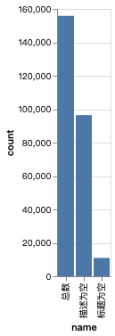
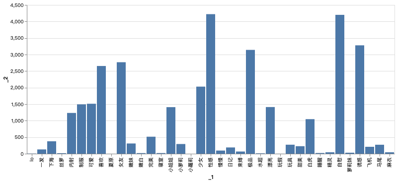

```python
'''
-------------------------------------------------------------------------------------
福利数据解析
基础数据分析，标题分词，词频统计
-----------------------------------
by:obaby
email: root@obaby.org.cn
blog:http://www.h4ck.org.cn
===================================
参考链接：https://sparkbyexamples.com/pyspark/select-columns-from-pyspark-dataframe/
-------------------------------------------------------------------------------------
'''
import jieba
```


```python
# raw_text = sc.textFile("hdfs://localhost:9000/data/porn_data_movie.csv")
```


```python
# raw_text.count()
```


```python
# raw_text.first()
```


```python
#!pip3 show jupyter
```


```python
# 通过spark read csv格式文件，从csv header解析数据结构
csv = spark.read.option("header",True).csv("hdfs://localhost:9000/data2/porn_data_movie.csv")
```


```python
# csv
```


```python
# 数据格式
csv.printSchema()
```

    root
     |-- id: string (nullable = true)
     |-- create: string (nullable = true)
     |-- update: string (nullable = true)
     |-- name: string (nullable = true)
     |-- describe: string (nullable = true)
     |-- source_id: string (nullable = true)
     |-- publish_time: string (nullable = true)
     |-- play_count: string (nullable = true)
     |-- good_count: string (nullable = true)
     |-- bad_count: string (nullable = true)
     |-- link_count: string (nullable = true)
     |-- comment_count: string (nullable = true)
     |-- designation: string (nullable = true)
     |-- category_id: string (nullable = true)
     |-- porn_site_id: string (nullable = true)
     |-- uploader_id: string (nullable = true)
     |-- producer: string (nullable = true)
    


```python
csv.show()
```

    +---+--------------------+--------------------+------------------------+------------------------+---------+------------+----------+----------+---------+----------+-------------+-----------+-----------+------------+-----------+--------+
    | id|              create|              update|                    name|                describe|source_id|publish_time|play_count|good_count|bad_count|link_count|comment_count|designation|category_id|porn_site_id|uploader_id|producer|
    +---+--------------------+--------------------+------------------------+------------------------+---------+------------+----------+----------+---------+----------+-------------+-----------+-----------+------------+-----------+--------+
    |  1|7/5/2020 05:20:14...|7/5/2020 05:20:14...|    美女学生考试时被中出|                    null|    76009|  1588819417|      2566|        14|        2|        48|            0|       null|          1|           1|          1|    null|
    |  2|7/5/2020 05:21:04...|7/5/2020 05:21:04...|      无套中出内射（上）|            无套中出内射|    76021|  1588757668|     11199|        58|        3|       338|            0|       null|          1|           1|          2|    null|
    |  3|7/5/2020 05:21:06...|7/5/2020 05:21:06...|      无套中出内射（下）|            无套中出内射|    76028|  1588757665|      7067|        39|        3|       310|            0|       null|          1|           1|          2|    null|
    |  4|7/5/2020 05:21:12...|7/5/2020 05:21:13...|                极品嫩妹|                    null|    76053|  1588756935|      3372|        18|        2|       159|            0|       null|          1|           1|          3|    null|
    |  5|7/5/2020 05:21:18...|7/5/2020 05:21:19...|                骚妹妹 7|                    null|    76051|  1588756876|      1975|        10|        0|        53|            0|       null|          1|           1|          3|    null|
    |  6|7/5/2020 05:22:13...|7/5/2020 05:22:13...|漂亮美女完美身材甜美声音|漂亮美女完美身材甜美声音|    75971|  1588744135|     17097|        31|        3|       222|            0|       null|          1|           1|          4|    null|
    |  7|7/5/2020 05:22:19...|7/5/2020 05:22:19...|          jk捆绑萝莉束缚|                    null|    75342|  1588739354|      8362|        29|        6|       201|            0|       null|          1|           1|          1|    null|
    |  8|7/5/2020 05:22:23...|7/5/2020 05:22:23...|            最纯萝莉性爱|                    null|    75112|  1588739158|     10329|        61|        5|       434|            0|       null|          1|           1|          1|    null|
    |  9|7/5/2020 05:22:30...|7/5/2020 05:22:31...|          整容脸制服美女|                    null|    75104|  1588739080|      5297|        26|        2|       221|            0|       null|          1|           1|          1|    null|
    | 10|7/5/2020 05:22:38...|7/5/2020 05:22:38...|             星 调教萝莉|                    null|    75563|  1588738220|      4725|        31|        5|       166|            0|       null|          1|           1|          5|    null|
    | 11|7/5/2020 05:22:44...|7/5/2020 05:22:45...|        大一学生寝室自慰|                    null|    75601|  1588686744|     20318|       152|        4|       773|            0|       null|          1|           1|          6|    null|
    | 12|7/5/2020 05:22:47...|7/5/2020 05:22:48...|    超性感美女给你打飞机|                    null|    75603|  1588686520|     17302|        54|        7|       333|            0|       null|          1|           1|          6|    null|
    | 13|7/5/2020 05:22:53...|7/5/2020 05:22:53...|      超可爱萝莉下海资源|                    null|    75747|  1588686493|     18133|        98|       10|       497|            0|       null|          1|           1|          6|    null|
    | 14|7/5/2020 05:22:56...|7/5/2020 05:22:57...|      迷倒女儿然后慢慢操|                    null|    75611|  1588686476|     59674|       182|       25|       793|            0|       null|          1|           1|          6|    null|
    | 15|7/5/2020 05:22:59...|7/5/2020 05:23:00...|   精灵做爱高潮–影视剪辑|                    null|    75543|  1588686387|      8767|       100|        7|       152|            0|       null|          1|           1|          7|    null|
    | 16|7/5/2020 05:23:16...|7/5/2020 05:23:16...|        小萝莉被插到大叫|                    null|    75307|  1588670775|     14213|        71|        8|       360|            0|       null|          1|           1|          6|    null|
    | 17|7/5/2020 05:23:21...|7/5/2020 05:23:22...|    睡醒和白嫩女友来一发|                    null|    75318|  1588668616|      5350|        30|        3|       185|            0|       null|          1|           1|          6|    null|
    | 18|7/5/2020 05:23:26...|7/5/2020 05:23:27...|  双马尾萝莉甜美自慰诱惑|                    null|    75382|  1588652017|     25311|       190|       10|       890|            0|       null|          1|           1|          8|    null|
    | 19|7/5/2020 05:23:28...|7/5/2020 05:23:29...|        调教双马尾小萝莉|                    null|    74932|  1588644358|     29114|       180|       19|       783|            0|       null|          1|           1|          1|    null|
    | 20|7/5/2020 05:23:35...|7/5/2020 05:23:36...|    黑丝小萝莉最喜欢玩具|                    null|    74812|  1588585581|     17084|       141|       10|       883|            0|       null|          1|           1|          9|    null|
    +---+--------------------+--------------------+------------------------+------------------------+---------+------------+----------+----------+---------+----------+-------------+-----------+-----------+------------+-----------+--------+
    only showing top 20 rows
    


```python
# csv.select('_c3','_c4').show()
```


```python
#df = csv.withColumnRenamed('_c3','name').withColumnRenamed('_c4', 'describe')
#df.printSchema()
```


```python
csv.select('name', 'describe').show()
```

    +------------------------+------------------------+
    |                    name|                describe|
    +------------------------+------------------------+
    |    美女学生考试时被中出|                    null|
    |      无套中出内射（上）|            无套中出内射|
    |      无套中出内射（下）|            无套中出内射|
    |                极品嫩妹|                    null|
    |                骚妹妹 7|                    null|
    |漂亮美女完美身材甜美声音|漂亮美女完美身材甜美声音|
    |          jk捆绑萝莉束缚|                    null|
    |            最纯萝莉性爱|                    null|
    |          整容脸制服美女|                    null|
    |             星 调教萝莉|                    null|
    |        大一学生寝室自慰|                    null|
    |    超性感美女给你打飞机|                    null|
    |      超可爱萝莉下海资源|                    null|
    |      迷倒女儿然后慢慢操|                    null|
    |   精灵做爱高潮–影视剪辑|                    null|
    |        小萝莉被插到大叫|                    null|
    |    睡醒和白嫩女友来一发|                    null|
    |  双马尾萝莉甜美自慰诱惑|                    null|
    |        调教双马尾小萝莉|                    null|
    |    黑丝小萝莉最喜欢玩具|                    null|
    +------------------------+------------------------+
    only showing top 20 rows
    


```python
#csv.count()
```


```python
from pyspark.sql.functions import col
import altair as alt

import pandas as pd
from matplotlib import pyplot as plt
%matplotlib inline

no_describe_count = csv.filter('describe is null').select('describe').count()
no_name_count = csv.filter('name is null').select('name').count()
total_count = csv.count()
print('没有描述信息行数:', str(no_describe_count))
print('没有标题行数:', str(no_name_count))
print('总行数：', str(total_count))
```

    没有描述信息行数: 96464
    没有标题行数: 10997
    总行数： 155856


```python
#csv.filter(col("describe") == '').count()
source = pd.DataFrame({
    'name':['描述为空', '标题为空', '总数'],
    'count':[no_describe_count, no_name_count, total_count]
})
alt.Chart(source).mark_bar().encode(
    x='name',
    y='count'
)
```


<div id="altair-viz-ae348446974e4317930376ad50595988"></div>
<script type="text/javascript">
  (function(spec, embedOpt){
    let outputDiv = document.currentScript.previousElementSibling;
    if (outputDiv.id !== "altair-viz-ae348446974e4317930376ad50595988") {
      outputDiv = document.getElementById("altair-viz-ae348446974e4317930376ad50595988");
    }
    const paths = {
      "vega": "https://cdn.jsdelivr.net/npm//vega@5?noext",
      "vega-lib": "https://cdn.jsdelivr.net/npm//vega-lib?noext",
      "vega-lite": "https://cdn.jsdelivr.net/npm//vega-lite@4.8.1?noext",
      "vega-embed": "https://cdn.jsdelivr.net/npm//vega-embed@6?noext",
    };

    function loadScript(lib) {
      return new Promise(function(resolve, reject) {
        var s = document.createElement('script');
        s.src = paths[lib];
        s.async = true;
        s.onload = () => resolve(paths[lib]);
        s.onerror = () => reject(`Error loading script: ${paths[lib]}`);
        document.getElementsByTagName("head")[0].appendChild(s);
      });
    }

    function showError(err) {
      outputDiv.innerHTML = `<div class="error" style="color:red;">${err}</div>`;
      throw err;
    }

    function displayChart(vegaEmbed) {
      vegaEmbed(outputDiv, spec, embedOpt)
        .catch(err => showError(`Javascript Error: ${err.message}<br>This usually means there's a typo in your chart specification. See the javascript console for the full traceback.`));
    }

    if(typeof define === "function" && define.amd) {
      requirejs.config({paths});
      require(["vega-embed"], displayChart, err => showError(`Error loading script: ${err.message}`));
    } else if (typeof vegaEmbed === "function") {
      displayChart(vegaEmbed);
    } else {
      loadScript("vega")
        .then(() => loadScript("vega-lite"))
        .then(() => loadScript("vega-embed"))
        .catch(showError)
        .then(() => displayChart(vegaEmbed));
    }
  })({"config": {"view": {"continuousWidth": 400, "continuousHeight": 300}}, "data": {"name": "data-b1b25e9f3f049b47faa45a93a1570dd5"}, "mark": "bar", "encoding": {"x": {"type": "nominal", "field": "name"}, "y": {"type": "quantitative", "field": "count"}}, "$schema": "https://vega.github.io/schema/vega-lite/v4.8.1.json", "datasets": {"data-b1b25e9f3f049b47faa45a93a1570dd5": [{"name": "\u63cf\u8ff0\u4e3a\u7a7a", "count": 96464}, {"name": "\u6807\u9898\u4e3a\u7a7a", "count": 10997}, {"name": "\u603b\u6570", "count": 155856}]}}, {"mode": "vega-lite"});
</script>

  

整体来说视频没有标题的数量较少，但是大多数的视频都没有描述信息。


```python
# !pip3 install altair -i https://pypi.tuna.tsinghua.edu.cn/simple
# !pip3 install matplotlib -i https://pypi.tuna.tsinghua.edu.cn/simple
```


```python
csv.rdd.first()

```


    Row(id='1', create='7/5/2020 05:20:14.134443', update='7/5/2020 05:20:14.768052', name='美女学生考试时被中出', describe=None, source_id='76009', publish_time='1588819417', play_count='2566', good_count='14', bad_count='2', link_count='48', comment_count='0', designation=None, category_id='1', porn_site_id='1', uploader_id='1', producer=None)


```python
pdf = csv.toPandas()
```


```python
pdf.head()
```


<div>
<style scoped>
    .dataframe tbody tr th:only-of-type {
        vertical-align: middle;
    }

    .dataframe tbody tr th {
        vertical-align: top;
    }

    .dataframe thead th {
        text-align: right;
    }
</style>
<table border="1" class="dataframe">
  <thead>
    <tr style="text-align: right;">
      <th></th>
      <th>id</th>
      <th>create</th>
      <th>update</th>
      <th>name</th>
      <th>describe</th>
      <th>source_id</th>
      <th>publish_time</th>
      <th>play_count</th>
      <th>good_count</th>
      <th>bad_count</th>
      <th>link_count</th>
      <th>comment_count</th>
      <th>designation</th>
      <th>category_id</th>
      <th>porn_site_id</th>
      <th>uploader_id</th>
      <th>producer</th>
    </tr>
  </thead>
  <tbody>
    <tr>
      <th>0</th>
      <td>1</td>
      <td>7/5/2020 05:20:14.134443</td>
      <td>7/5/2020 05:20:14.768052</td>
      <td>美女学生考试时被中出</td>
      <td>None</td>
      <td>76009</td>
      <td>1588819417</td>
      <td>2566</td>
      <td>14</td>
      <td>2</td>
      <td>48</td>
      <td>0</td>
      <td>None</td>
      <td>1</td>
      <td>1</td>
      <td>1</td>
      <td>None</td>
    </tr>
    <tr>
      <th>1</th>
      <td>2</td>
      <td>7/5/2020 05:21:04.500403</td>
      <td>7/5/2020 05:21:04.994096</td>
      <td>无套中出内射（上）</td>
      <td>无套中出内射</td>
      <td>76021</td>
      <td>1588757668</td>
      <td>11199</td>
      <td>58</td>
      <td>3</td>
      <td>338</td>
      <td>0</td>
      <td>None</td>
      <td>1</td>
      <td>1</td>
      <td>2</td>
      <td>None</td>
    </tr>
    <tr>
      <th>2</th>
      <td>3</td>
      <td>7/5/2020 05:21:06.562127</td>
      <td>7/5/2020 05:21:06.916907</td>
      <td>无套中出内射（下）</td>
      <td>无套中出内射</td>
      <td>76028</td>
      <td>1588757665</td>
      <td>7067</td>
      <td>39</td>
      <td>3</td>
      <td>310</td>
      <td>0</td>
      <td>None</td>
      <td>1</td>
      <td>1</td>
      <td>2</td>
      <td>None</td>
    </tr>
    <tr>
      <th>3</th>
      <td>4</td>
      <td>7/5/2020 05:21:12.77195</td>
      <td>7/5/2020 05:21:13.217674</td>
      <td>极品嫩妹</td>
      <td>None</td>
      <td>76053</td>
      <td>1588756935</td>
      <td>3372</td>
      <td>18</td>
      <td>2</td>
      <td>159</td>
      <td>0</td>
      <td>None</td>
      <td>1</td>
      <td>1</td>
      <td>3</td>
      <td>None</td>
    </tr>
    <tr>
      <th>4</th>
      <td>5</td>
      <td>7/5/2020 05:21:18.718269</td>
      <td>7/5/2020 05:21:19.039071</td>
      <td>骚妹妹 7</td>
      <td>None</td>
      <td>76051</td>
      <td>1588756876</td>
      <td>1975</td>
      <td>10</td>
      <td>0</td>
      <td>53</td>
      <td>0</td>
      <td>None</td>
      <td>1</td>
      <td>1</td>
      <td>3</td>
      <td>None</td>
    </tr>
  </tbody>
</table>
</div>


```python
# pdf['playc_count'] = pd.to_numeric(pdf['play_count'], errors='ignore')
```


```python

```


```python
# pdf['play_count_int'] = pdf['play_count'].astype(int)
pdf['playc_count'] = pd.to_numeric(pdf['play_count'], errors='coerce')
```


```python
pdf['playc_count'] = pdf['playc_count'].fillna(0)
```


```python
pdf.info()
```

    <class 'pandas.core.frame.DataFrame'>
    RangeIndex: 155856 entries, 0 to 155855
    Data columns (total 18 columns):
     #   Column         Non-Null Count   Dtype  
    ---  ------         --------------   -----  
     0   id             155855 non-null  object 
     1   create         154126 non-null  object 
     2   update         154316 non-null  object 
     3   name           144859 non-null  object 
     4   describe       59392 non-null   object 
     5   source_id      151995 non-null  object 
     6   publish_time   151994 non-null  object 
     7   play_count     151185 non-null  object 
     8   good_count     150036 non-null  object 
     9   bad_count      151081 non-null  object 
     10  link_count     151110 non-null  object 
     11  comment_count  150634 non-null  object 
     12  designation    36394 non-null   object 
     13  category_id    35416 non-null   object 
     14  porn_site_id   149667 non-null  object 
     15  uploader_id    70964 non-null   object 
     16  producer       3 non-null       object 
     17  playc_count    155856 non-null  float64
    dtypes: float64(1), object(17)
    memory usage: 21.4+ MB


```python
# 总播放次数，数据中的播放次数并没有进行实时更新，所以数值偏小
# 另外部分网站没有返回播放次数，所以一定程度上也减小了这个实际的总次数，即使如此，播放次数还是比较大的
print('总播放次数:',pdf['playc_count'].sum())
```

    总播放次数: 6277445731.0


```python
print('平均播放次数：',pdf['playc_count'].mean())
```

    平均播放次数： 40277.21570552305


```python
print('最高播放次数:', pdf['playc_count'].max())
print('最低播放次数:', pdf['playc_count'].min()) # 部分网站没有返回播放次数信息，爬虫无法获取播放次数
```

    最高播放次数: 12777854.0
    最低播放次数: 0.0


```python

# play_count_df = pd.cut(pdf['playc_count'], 
#                        bins=[0, 100, 200, 300, 400, 500,600,700,800,900, 1000,1100, 12000],
#                       right=False,
#                       labels=['0', '1-99', '100-199', '200-299', '300-399', '400-499', '500-599', '600-699', '700-799', '800-899', '900-999', '>1K']
#                       )
# play_count_df
quartiles = pd.cut(pdf.playc_count, 30)
quartiles.head()

# 定义聚合函数
def get_stats(group):
    return {'playc_count': group.sum()}

# 分组统计
grouped = pdf.playc_count.groupby(quartiles)
price_bucket_amount = grouped.apply(get_stats).unstack()
```


```python
price_bucket_amount.head()
```


<div>
<style scoped>
    .dataframe tbody tr th:only-of-type {
        vertical-align: middle;
    }

    .dataframe tbody tr th {
        vertical-align: top;
    }

    .dataframe thead th {
        text-align: right;
    }
</style>
<table border="1" class="dataframe">
  <thead>
    <tr style="text-align: right;">
      <th></th>
      <th>playc_count</th>
    </tr>
    <tr>
      <th>playc_count</th>
      <th></th>
    </tr>
  </thead>
  <tbody>
    <tr>
      <th>(-12777.854, 425928.467]</th>
      <td>4.329000e+09</td>
    </tr>
    <tr>
      <th>(425928.467, 851856.933]</th>
      <td>9.426015e+08</td>
    </tr>
    <tr>
      <th>(851856.933, 1277785.4]</th>
      <td>3.389843e+08</td>
    </tr>
    <tr>
      <th>(1277785.4, 1703713.867]</th>
      <td>1.600206e+08</td>
    </tr>
    <tr>
      <th>(1703713.867, 2129642.333]</th>
      <td>1.297862e+08</td>
    </tr>
  </tbody>
</table>
</div>


```python
#from altair import *
#Chart(pdf[:4999]).mark_bar().encode(
#    x=X('play_count:Q'),
#    y='count(*):Q')
```


```python
name_rdd = csv.select('name').rdd
```


```python
name_rdd.count()
```


    152841


```python

```


```python
def splitCH(line):
    is_contain_one_word=False
    words = jieba.cut(str(line))
    l =[]
    if not is_contain_one_word:
        for w in words:
            if len(w)>1:
                l.append(str(w))
        return l
    return list(words)
    
```


```python

```


```python
name_rdd.first()
```


    Row(name='美女学生考试时被中出')


```python
# name_word_rdd = name_rdd.flatMap(lambda name: str(name).split(' '))
name_word_rdd = name_rdd.flatMap(splitCH)
```


```python
name_word_rdd.count()
```


    1006110


```python
name_word_rdd.first()
```


    'Row'


```python
name_word_rdd.take(20)
```


    ['Row',
     'name',
     '美女',
     '学生',
     '考试',
     '中出',
     'Row',
     'name',
     '无套',
     '中出',
     '内射',
     'Row',
     'name',
     '无套',
     '中出',
     '内射',
     'Row',
     'name',
     '极品',
     '嫩妹']


```python
# map reduce 进行词频统计
name_counts_rdd = name_word_rdd.map(lambda x:(x,1)).reduceByKey(lambda x,y:x+y)

```


```python
print('单词统计一共:', str(name_counts_rdd.count()))
```

    单词统计一共: 60585


```python
name_counts_rdd.saveAsTextFile('hdfs://localhost:9000/data2/name_counts.txt')
```


```python
name_counts_rdd.sortBy(lambda a: a[1],ascending=False).collect()[:20]
```


    [('name', 155856),
     ('Row', 155856),
     ('None', 10997),
     ('中文字幕', 8903),
     ('美女', 6111),
     ('巨乳', 4368),
     ('性感', 4222),
     ('自慰', 4201),
     ('啪啪', 3983),
     ('诱惑', 3279),
     ('人妻', 3239),
     ('极品', 3141),
     ('妹妹', 3131),
     ('女友', 2768),
     ('性爱', 2758),
     ('少妇', 2752),
     ('美少女', 2668),
     ('喜欢', 2654),
     ('高潮', 2624),
     ('酒店', 2392)]


通过上面的统计其实可以看出，鉴于很多网站还有很多来源于日本的视频，所以中文字幕的词频依然非常高。除此之外还可以看到一些常用的描述性词汇。


```python
name_counts_df = name_counts_rdd.toDF().toPandas()

```


```python
name_counts_df.head()
```


<div>
<style scoped>
    .dataframe tbody tr th:only-of-type {
        vertical-align: middle;
    }

    .dataframe tbody tr th {
        vertical-align: top;
    }

    .dataframe thead th {
        text-align: right;
    }
</style>
<table border="1" class="dataframe">
  <thead>
    <tr style="text-align: right;">
      <th></th>
      <th>_1</th>
      <th>_2</th>
    </tr>
  </thead>
  <tbody>
    <tr>
      <th>0</th>
      <td>name</td>
      <td>155856</td>
    </tr>
    <tr>
      <th>1</th>
      <td>美女</td>
      <td>6111</td>
    </tr>
    <tr>
      <th>2</th>
      <td>无套</td>
      <td>1323</td>
    </tr>
    <tr>
      <th>3</th>
      <td>内射</td>
      <td>1234</td>
    </tr>
    <tr>
      <th>4</th>
      <td>极品</td>
      <td>3141</td>
    </tr>
  </tbody>
</table>
</div>


```python
# 部分单词词频展示
alt.Chart(name_counts_df[3:40]).mark_bar().encode(
    x='_1',
    y='_2'
)
```


<div id="altair-viz-75c110a8a87643d6a1052fb49414da7a"></div>
<script type="text/javascript">
  (function(spec, embedOpt){
    let outputDiv = document.currentScript.previousElementSibling;
    if (outputDiv.id !== "altair-viz-75c110a8a87643d6a1052fb49414da7a") {
      outputDiv = document.getElementById("altair-viz-75c110a8a87643d6a1052fb49414da7a");
    }
    const paths = {
      "vega": "https://cdn.jsdelivr.net/npm//vega@5?noext",
      "vega-lib": "https://cdn.jsdelivr.net/npm//vega-lib?noext",
      "vega-lite": "https://cdn.jsdelivr.net/npm//vega-lite@4.8.1?noext",
      "vega-embed": "https://cdn.jsdelivr.net/npm//vega-embed@6?noext",
    };

    function loadScript(lib) {
      return new Promise(function(resolve, reject) {
        var s = document.createElement('script');
        s.src = paths[lib];
        s.async = true;
        s.onload = () => resolve(paths[lib]);
        s.onerror = () => reject(`Error loading script: ${paths[lib]}`);
        document.getElementsByTagName("head")[0].appendChild(s);
      });
    }

    function showError(err) {
      outputDiv.innerHTML = `<div class="error" style="color:red;">${err}</div>`;
      throw err;
    }

    function displayChart(vegaEmbed) {
      vegaEmbed(outputDiv, spec, embedOpt)
        .catch(err => showError(`Javascript Error: ${err.message}<br>This usually means there's a typo in your chart specification. See the javascript console for the full traceback.`));
    }

    if(typeof define === "function" && define.amd) {
      requirejs.config({paths});
      require(["vega-embed"], displayChart, err => showError(`Error loading script: ${err.message}`));
    } else if (typeof vegaEmbed === "function") {
      displayChart(vegaEmbed);
    } else {
      loadScript("vega")
        .then(() => loadScript("vega-lite"))
        .then(() => loadScript("vega-embed"))
        .catch(showError)
        .then(() => displayChart(vegaEmbed));
    }
  })({"config": {"view": {"continuousWidth": 400, "continuousHeight": 300}}, "data": {"name": "data-f181031efefab923ac1bc5fc39792db7"}, "mark": "bar", "encoding": {"x": {"type": "nominal", "field": "_1"}, "y": {"type": "quantitative", "field": "_2"}}, "$schema": "https://vega.github.io/schema/vega-lite/v4.8.1.json", "datasets": {"data-f181031efefab923ac1bc5fc39792db7": [{"_1": "\u5185\u5c04", "_2": 1234}, {"_1": "\u6781\u54c1", "_2": 3141}, {"_1": "\u5ae9\u59b9", "_2": 310}, {"_1": "\u6f02\u4eae", "_2": 1412}, {"_1": "\u5b8c\u7f8e", "_2": 515}, {"_1": "\u751c\u7f8e", "_2": 228}, {"_1": "\u675f\u7f1a", "_2": 67}, {"_1": "\u5236\u670d", "_2": 1494}, {"_1": "\u5bdd\u5ba4", "_2": 20}, {"_1": "\u81ea\u6170", "_2": 4201}, {"_1": "\u6027\u611f", "_2": 4222}, {"_1": "\u98de\u673a", "_2": 210}, {"_1": "\u53ef\u7231", "_2": 1512}, {"_1": "\u4e0b\u6d77", "_2": 377}, {"_1": "\u6162\u6162", "_2": 96}, {"_1": "\u7cbe\u7075", "_2": 44}, {"_1": "\u5c0f\u841d\u8389", "_2": 294}, {"_1": "\u7761\u9192", "_2": 22}, {"_1": "\u5973\u53cb", "_2": 2768}, {"_1": "\u4e00\u53d1", "_2": 130}, {"_1": "\u9a6c\u5c3e", "_2": 272}, {"_1": "\u8bf1\u60d1", "_2": 3279}, {"_1": "\u559c\u6b22", "_2": 2654}, {"_1": "\u73a9\u5177", "_2": 273}, {"_1": "\u5ae9\u767d", "_2": 19}, {"_1": "\u4e1d\u841d", "_2": 16}, {"_1": "lo", "_2": 8}, {"_1": "\u5c0f\u59d0\u59d0", "_2": 1409}, {"_1": "\u65e5\u8bb0", "_2": 190}, {"_1": "\u9ebb\u8863", "_2": 44}, {"_1": "\u6c34\u8d85", "_2": 13}, {"_1": "\u767d\u864e", "_2": 1046}, {"_1": "\u5c11\u5973", "_2": 2030}, {"_1": "\u841d\u8389\u59b9", "_2": 31}, {"_1": "\u590f\u539f", "_2": 3}, {"_1": "\u5c0f\u863f\u8389", "_2": 1}, {"_1": "\u73a9\u5047", "_2": 4}]}}, {"mode": "vega-lite"});
</script>


  
代码参考notebooks/data_anaylize.ipynb  
数据参考data目录下相关文件  
